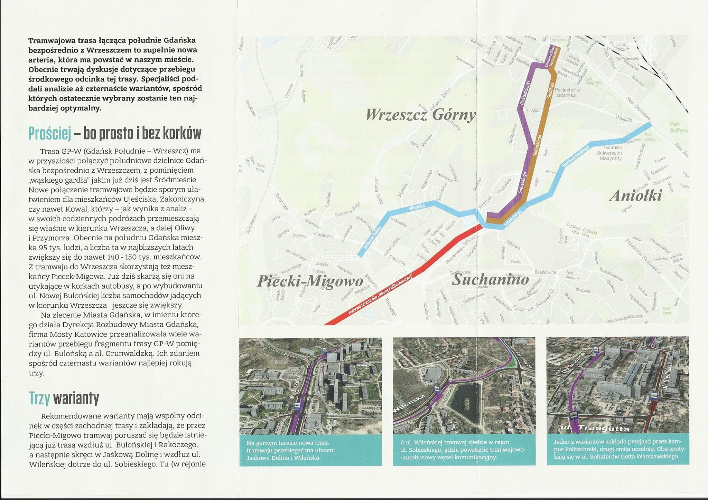
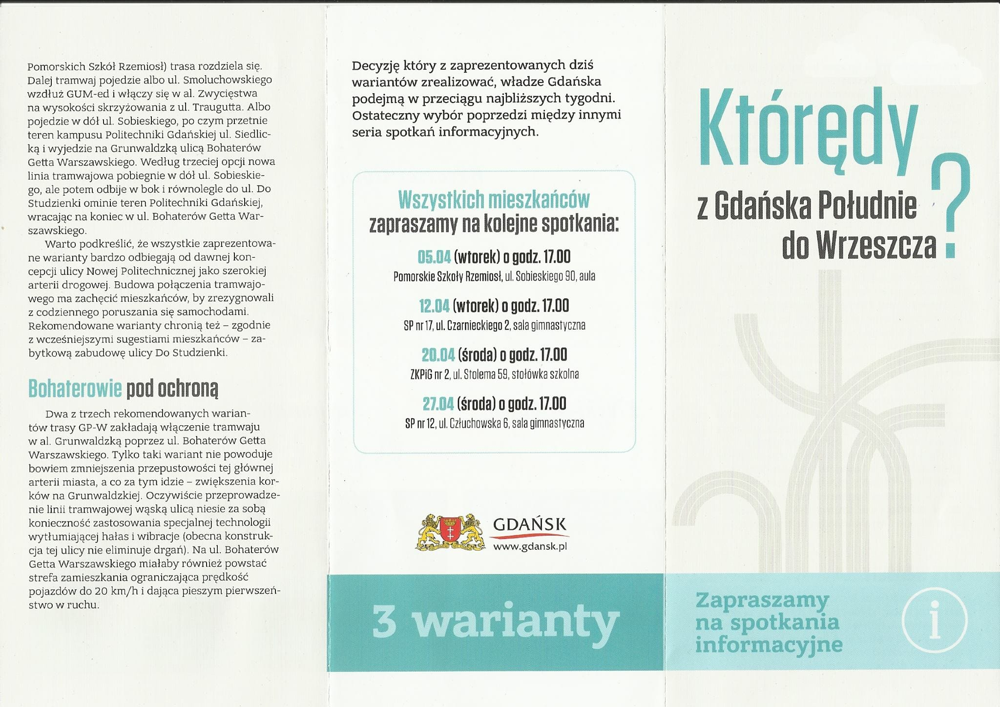

+++
title = '... o historii "spotkań informacyjnych" w sprawie tzw. Nowej Politechnicznej'
date = '2024-06-30'
draft = false
tags = ['aktualnosci']
+++

Miasto przez cały czas trwania projektu nie przeprowadziło konsultacji społecznych odnośnie przebiegu trasy, natomiast regularnie podciągając inne projekty jako konsultacje społeczne trasy Gdańsk Południe - Wrzeszcz, nagina tym samym fakty. 

<!--more-->

Miasto regularnie powołuje się na 
 - warsztaty przeprowadzane przez Biuro Architekta Miasta Gdańska w 2022 roku,
 - spotkania informacyjne przeprowadzone z mieszkańcami w 2016 roku,
 - głos mieszkańców o uniknięciu wyburzenia historycznej tkanki (pięciu kamienic przy ulicy Do Studzienki: 4,5,6, 18/20 i 24) - w ramach konsultacji innego rejonu Gdańska w 2015 roku. 

Niemniej jednak, spotkanie te albo nie dotyczyły rzeczonej inwestycji (trasy Nowa Politechniczna), albo nie były konsultacjami społecznymi w myśl uchwały Rady Miasta Gdańska (Uchwała Rady Miasta Gdańska nr XVI/494/15, z dnia 26 listopada 2016r. w sprawie określenia zasad i trybu przeprowadzania konsultacji społecznych z mieszkańcami miasta Gdańska - [treść uchwały PDF](Uchwala-Nr-XVI-494-15-Rady-Miasta-Gdanska.pdf)), tzn. nie spełniały przynajmniej części z wymagań narzuconych przez uchwałę. To znaczy (między innymi):
 - miasto w żaden sposób nie odniosło się do uwag i postulatów mieszkańców, 
 - nie został sporządzony raport podsumowujący, zawierający informacje o sposobie ustosunkowania się Prezydenta do opinii Mieszkańców, w szczególności:
    - opiniach uwzględnionych, rozstrzygnięciach lub rekomendowanych kierunkach działań,
    - kwestiach wymagających dalszych uzgodnień,
    - opiniach nieuwzględnionych.
 - raport nie został opublikowany na stronach internetowych Urzędu Miejskiego

| Aktualizacje |
| ---------- | ----------- |
| 14.07.2024 | Informacje z aneksu do Aktualizacji SPT - pozytywnie oceniające pominięte przez miasto warianty. Informacje prasowe na temat odrzucenia przez DRMG koreferatu |
| 21.07.2024 | Dodanie informacji o konsultacjach dot. Studium uwarunkowań i kierunków zagospodarowania przestrzennego, na które miasto stara się powoływać |

---

## Warsztaty organizowane przez Biuro Architekta Miasta

Jedno ze spotkań na które powołuje się miasto - przedstawiając je jako konsultacje społeczne - to warsztaty organizowane przez Biuro Architekta Miasta, dotyczące "nowych przestrzeni Do Studzienki". Spotkania odbywały się w dniach:
* 29 września 2022 w Budynku Hydromechaniki PG
* 24 października 2022 w Budynku Hydromechaniki PG
* 7 listopada 2022 w Budynku Hydromechaniki PG
* 27 listopada 2022 w Budynku Hydromechaniki PG

O tym że nie były to konsultacje przyznaje Architekt Miasta Gdańska, prof. Piotr Lorenc.
> Procesy partycypacyjne prowadzone przez Biuro w formule
Gdańskich Warsztatów Projektowych (GWP) nie są konsultacjami społecznymi w
rozumieniu ustawy o planowaniu... oraz uchwały RMG, w związku z czym nie wpisują się w
procedury publikowania i formalizowania zaproszeń, pisemnego zgłaszania uwag i opinii
oraz informacji harmonogramowych
* [pełne wyjaśnienia charakteru spotkań Nowe Przestrzenie Publiczne Do Studzienki - PDF](BAM_dostudzienki_odp.pdf)
* [raport z przeprowadzonych spotkań - PDF](BAM_dostudzienki_raport.pdf)

---

## Spotkania informacyjne dla mieszkańców

Kolejne spotkania to spotkania informacyjne organizowane przez Biuro Rozwoju Miasta Gdańska, Dyrekcję Rozbudowy Miasta Gdańska oraz spółkę Mosty Katowice. Nie były konsultacjami, a spotkaniami informacyjnymi - wedle słów organizatorów podczas spotkania.
* https://youtu.be/PpE1Ti2414A?feature=shared&t=255 - spotkanie informacyjne Szkoła Rzemiosł, 2016-04-05, minuta 04:20
* https://youtu.be/PpE1Ti2414A?feature=shared&t=4338 - spotkanie informacjne Szkoła Rzemiosł, 2016-04.05, godzina 1:12:16
* https://youtu.be/0wI-c6uNS6Y?feature=shared&t=135 - spotkanie informacyjne w SP17, 2016-04-12 minuta 2:15

Spotkania odbywały się w wymienionych poniżej dniach. Załączone raporty ze spotkań były wewnętrznymi dokumentami Dyrekcji Rozbudowy Miasta Gdańska o które wystąpiliśmy (raporty nie były publikowane):
* 16 marca 2016 w XX LO w Gdańsku ([raport ze spotkania - PDF](1_raport_xx_lo_20160316.pdf))
* 5 kwietnia 2016 w Pomorskiej Szkole Rzemiosł w Gdańsku ([raport ze spotkania - PDF](2_raport_psr_20160405.pdf))
* 12 kwietnia 2016 w Szkole Podstawowej nr 17 w Gdańsku ([raport ze spotkania - PDF](3_raport_sp17_20160412.pdf))
* 20 kwietnia 2016 w ZKPiG 2 w Gdańsku ([raport ze spotkania - PDF](4_raport_sp85_20160420.pdf))
* 27 kwietnia 2016 w  Szkole Podstawowej nr 12 w Gdańsku ([raport ze spotkania - PDF](5_raport_sp12_20160427.pdf))

Nie były to konsultacje także ze względu na to że uwagi mieszkańców nie były zbieranie, nie udzielano odpowiedzi na pytania mieszkańców oraz uwagi mieszkańców nie były elementem raportu - nigdy nie zostały opracowane. Dyrekcja Rozbudowy Miasta Gdańska (organizująca spotkania), zapytana o pytania (o listę zgłoszonych uwag i opinii, wraz z odpowiedziami) mieszkańców odpowiedziała:
> Realizacja wniosku wymaga ponadstandardowego nakładu pracy, wymagającej użycia dodatkowych sił i środków oraz zaangażowania intelektualnego w stosunku do posiadanych przez niego danych, a informacja wyodrębniana byłaby jedynie w związku z żądaniem wnioskodawcy oraz na podstawie kryteriów przez niego wskazanych, uznać należy, że żądana informacja jest informacją przygotowywaną "specjalnie" dla wnioskodawcy wedle wskazanych przez niego kryteriów, na podstawie pierwotnego zasobu danych, a więc informacją przetworzoną. 

* [pełna odpowiedź DRMG na zapytanie o dostęp do informacji](DRMG_raporty_ze_spotkan.pdf)

---

## Manipulacje głosem mieszkańców

Spotkania podczas których pojawiały się głosy mieszkańców dotyczące zachowania historycznej zabudowy ulicy Do Studzienki (wedle słów wiceprezydenta Piotra Grzelaka podczas absolutoryjnej sesji Rady Miasta Gdańska 20 czerwca 2024 roku - https://youtu.be/YZLNpcAQbGc?feature=shared&t=2120, minuta 35:25 nagrania) dotyczyły innej kwestii; w 2015 roku Biuro Rozwoju Gdańska konsultowało Strategiczny Program Transportowy dla Dzielnicy Południe w Mieście Gdańsku ([pełna treść dokumentu - PDF](Aktualizacja__SPT.pdf)). Były to konsultacje odnośnie zupełnie innej trasy niż linia tramwajowa przez ulicę Bohaterów Getta Warszawskiego. To propozycja trasy drogowo-tramwajowej, o przekroju 2x2 poprzez przygotowaną rezerwę terenową (MPZP 0808), wzbudziła sprzeciw mieszkańców. Wykorzystanie wyrwanych z kontekstu wypowiedzi mieszkańców o zachowaniu jednej części miasta, po to aby narażać pobliską okolicę na ryzyko katastrofy budowlanej - jest przejawem głębokiego cynizmu.

Do Strategicznego Projektu Transportowego mieszkańcy zgłaszali uwagi, także na temat wyburzeń przy ulicy Do Studzienki:
> "nie został omówiony newralgiczny odcinek Nowej Politechnicznej, który znajduje się na terenie dzielnic Wrzeszcz Górny i Wrzeszcz Dolny. W przypadku przyjętego w Strategii rozwiązania - realizacji części drogowej Nowej Politechnicznej w klasie drogi zbiorczej o przekroju 2X2, zmiany odczuwalne przez mieszkańców Wrzeszcza byłyby wyjątkowo niekorzystne w wielu aspektach: wpływ na istniejący już układ komunikacyjny (m.in. obecnie już silnie przeciążone skrzyżowanie Grunwaldzka/Miszewskiego/Do studzienki), konieczność kolejnych inwestycji drogowych, wzrost hałasu i skażenia powietrza, wyburzenia obiektów zabytkowych i zmiana charakteru przestrzeni wokół planowanej inwestycji. Problemy te od kilku miesięcy są tematem ożywionej debaty publicznej - nie znalazły jednak żadnego odzwierciedlenia w przedstawionych dokumentach, a są przecież kluczowe dla decyzji dotyczącej realizacji i ewentualnej formie Nowej Politechnicznej."

Miasto odrzuciło takie wnioski, argumentując że powyższy fragment miasta nie był przedmiotem konsultacji.
> "Prognozę oddziaływania na środowisko sporządzono dla potrzeb projektu Aktualizacji Strategicznego programu transportowego dzielnicy Południe w mieście Gdańsku, którego przedmiotem była koncepcja realizacji układu transportowego w północnej części tej dzielnicy.
W prognozie omówiono wpływ realizacji Nowej Politechnicznej tylko w zakresie oddziaływania na środowisko w granicach obszaru objętego projektem Programu oraz terenów bezpośrednio za jego granicą czyli odcinek Nowej Politechnicznej na terenie dzielnic Wrzeszcz Górny i Wrzeszcz Dolny nie był poddany analizie." 

* [raport z konsultacji SPT, strona 110 raportu, uwaga 10](Aktualizacja__SPT.pdf). 

Dlatego też, głosy mieszkańców dotyczące zachowania ulicy Do Studzienki należy traktować jako obserwacje osobiste pojedynczych mieszkańców, a zaś za głosy skonsultowane społecznie. 

Co więcej, miasto (komunikatami Biura Rozwoju Gdańska) samo przyznało, że istotą planowania jest wykorzystywanie rezerw terenowych do poprowadzenia inwestycji o charakterze uciążliwym dla mieszkańców:
> "Autor pyta czym są gorsi mieszkańcy Do Studzienki od mieszkańców Bohaterów Getta Warszawskiego, którym to „funduje” się ulicę z tramwajem pod oknami. Wynika to z natury planowania w ogóle, gdzie wyprzedzająco – z perspektywy kilku lat i więcej – należy przewidywać rozwiązania i tworzyć warunki dla prawdopodobnej realizacji w przyszłości. Nowa Politechniczna istnieje w dokumentach planistycznych od wielu lat, a rezerwa terenowa w planach miejscowych od kilkunastu. A więc mieszkańcy ul. Do Studzienki, jak i inni żywo interesujący się miastem, winni mieć świadomość, że ich budynki sąsiadują z rezerwą terenową pod Nową Politechniczną, w przeciwieństwie do mieszkańców ulic, po których (...) poprowadził alternatywną trasę tramwaju."

* [kompletna odpowiedź BRG na artykuły prasowe - PDF](2015.04_Biuro_Rozwoju_Gdansk_fb.pdf)
* oryginał wiadomości: https://www.facebook.com/BiuroRozwojuGdanska/posts/854724301283066)

Co ciekawe, wspomniany Strategiczny Program Transportowy, już w 2016 roku stwierdzał że tzw. **wariant filetowy 2 "Od ulicy Fiszera trasa biegnie korytarzem wzdłuż istniejącej ulicy Do StudzienkiBudowa kończy się na skrzyżowaniu z Aleją Grunwaldzką." jest korzystniejszy** (i zdobył więcej punktów niż proponowany wariant przez ulicę Bohaterów Getta Warszawskiego).
* [aneks do aktualizacji SPT, strona 14](Aktualizacja__SPT-aneks.pdf). 
  
---

## Studium uwarunkowań i kierunków zagospodarowania przestrzennego

Miasto Gdańsk próbuje także sprowadzać uzasadnienie wszystkich projektowanych linii tramwajowych do jednych, ogólnych konsultacji nad Studium uwarunkowań i kierunków zagospodarowania przestrzennego w 2018 roku. Mimo, że wiceprezydent Grzelak przywołuje inny dokument, słowami: Gdańsk Południe - Wrzeszcz i tramwaj w Klonowej to są dwa elementy (tej samej inwestycji), którego przebieg był konsultowany w ramach tych samych konsultacji które odbywały się w ramach Gdańsk Południe - Wrzeszcz i one odbywały się od 2015 roku (wiceprezydent Piotr Grzelak podczas absolutoryjnej sesji Rady Miasta Gdańska 20 czerwca 2024 roku - https://youtu.be/YZLNpcAQbGc?feature=shared&t=2082, minuta 34:40 nagrania)

Jest to wypowiedź na tyle nieprecyzyjna (wspomniane wcześniej konsultacje Strategicznego programu transportowego dzielnicy Południe odrzucają informacje np. o ulicy Klonowej), we Dyrekcja Rozbudowy Miasta Gdańska musiała prostować słowa wiceprezydenta. 

> (...) odnosząc się do wypowiedzi wiceprezydenta Piotra Grzelaka, z sesji rady miasta (z dnia 20.06.24 r.), dot. konsultacji na temat przebiegu linii tramwajowej przez ul. Klonową, uprzejmie informujemy, że w szczególności chodziło tu o działania partycypacyjne dotyczące Studium uwarunkowań i kierunków zagospodarowania przestrzennego, które przechodziło przez proces konsultacji społecznych. Wyłożenie projektu Studium, trwało od 23 października do 21 listopada 2017, natomiast uwagi można było składać od 23 października do 12 grudnia 2017 roku. Jako, że DRMG nie organizowało spotkań dot. Studium, szczegóły na temat można uzyskać w Biurze Rozwoju Gdańska. Ponadto podczas wspomnianych przez Pana spotkań, dotyczących przebiegu trasy Gdańsk Południe- Wrzeszcz w roku 2016, również mówiono o koncepcji tramwaju przez ul. Klonową, jako niezbędnym elemencie trasy GPW, planowanym do realizacji w kolejnych etapach.
* [odpowiedź DRMG na pismo](20240708-konsultacje_klonowa.pdf)

Wspomniane przez DRMG studium (SUiKZ) nie definiuje w żaden sposób wariantów trasy GPW, uciekając od jakichkolwiek konkretów:
> Przewiduje się dalszy rozwój układu linii tramwajowych w dzielnicy Południe w ramach: Nowej Bulońskiej Północnej i Południowej, Nowej Warszawskiej i Nowej Świętokrzyskiej. Realizacja planowanego połączenia tramwajowego pod nazwą Gdańsk Południe Wrzeszcz (GPW), prowadzonego ulicami: Nowa Bulońska Północna, Bulońska, Rakoczego, Jaśkowa Dolina, Wileńska, i dalej w kierunku dolnego tarasu rezerwą tzw. Nowej Politechnicznej, zapewni mieszkańcom południowych dzielnic sprawny dojazd transportem zbiorowym do ośrodków akademickich, miejsc pracy i handlu zlokalizowanych we Wrzeszczu i Oliwie, z ominięciem Śródmieścia. Na końcowym odcinku tej trasy (w okolicach skrzyżowania z al. Grunwaldzką) dopuszcza się prowadzenie tramwaju zarówno wzdłuż ul. Do Studzienki w dotychczasowym korytarzu ul. Nowej Politechnicznej, jak i alternatywnie w korytarzu ul. Fiszera i Bohaterów Getta Warszawskiego (strona 262 studium)
* [Studium uwarunkowań i kierunków zagospodarowania przestrzennego](STUDIUM_zalacznik_uchwaly.pdf)

Co później zostało potwierdzone podczas odnoszenia się do uwag mieszkańców:
> Na zlecenie miasta powstała dokumentacja dotyczaca połączenia transportem zbiorowym dzielnicy Południe z Wrzeszczem, nazywana trasa GPW. W ramach dokumentacji przebadano 16 wariantów prowadzenia trasy tramwajowej - do wniosku o decyzje srodowiskowa wybrana została trasa wzdłuż ul. Jaśkowa Dolina, Wilenska, Nowa Politechniczna i alternatywnie ul. Bohaterów Getta Warszawskiego i ul. Do Studzienki, jako odpowiedź na bieżące zapotrzebowanie na przewozy transportem zbiorowym pomiedzy ww. dzielnicami miasta. W ramach wielokryterialnej analizy przebieg trasy tramwajowej w sladzie ul. Nowej Politechnicznej wskazywany byt jako wariant mozliwy do realizacji w dalszej perspektywie czasowej, jako element uzupełniający sie tramwajową (uwaga 82.30 - strona 68)
* [Rozpatrzenie uwag wniesionych do projektu Studium uwarunkowan i kierunków zagospodarowania prestrzennego miasta Gdanska](rozpatrzenie-uwag-do-projektu-studium.pdf)

W kontekście powyższego, można przyjąć że wycofanie Miasta Gdańska wniosku o decyzję środowiskową dla prowadzenia tramwaju wzdłuż ul. Do Studzienki w dotychczasowym korytarzu ul. Nowej Politechnicznej, a pozostawienie wariantu alternatywnego przez ulicę Bohaterów Getta Warszawskiego było działaniem wbrew własnemu studium, czyli wbrew własnego "aktowi kierownictwa wewnętrznego", czyli obowiązującego lokalne władze samorządowe. Decyzja została podjęta przez ówczesnego wiceprezydenta Alana Aleksandrowicza
* [Decyzja o wycofaniu wariantu włączenia tramwaju w ulicę Grunwaldzką przez ul. Do Studzienki](2019-12-11_wycofanie_wniosku_srodowiskowego.pdf)

---

## Manipulacje głosem naukowców

Jako takie, konsultacje w 2015 roku dotyczyły zupełnie innej trasy, wykorzystywanie głosu mieszkańców w stosunku do prowadzenia linii tramwajowej ulicą Bohaterów Getta Warszawskiego jest manipulacją władz Gdańska. W szczególności w momencie rezygnacji budowy drogi o przekroju 2x2 (wspomniana wypowiedź wiceprezydenta Grzelaka podczas absolutoryjnej sesji Rady Miasta Gdańska w dniu 20 czerwca 2024). 
Nie można z kontekstu historycznego wybierać jednego elementu (głosy o braku wyburzeń) i ignorować inne, pojawiające się w owym czasie. Na przykład o możliwości przeprowadzenia trasy tramwajowej poprzez ulicę Do Studzienki, tak jako została ona ukazana na wizualizacjach (na zlecenia Miasta Gdańsk) przez Forum Rozwoju Aglomeracji Gdańskiej (FRAG) - [źródłowy artykuł na urbnews](https://urbnews.pl/gdansk-jaka-bedzie-nowa-politechniczna/amp/), [lokalna kopia PDF - dostęp 30.06.2024](Gdansk_jaka_bedzie_nowa_politechniczna-urbnews.pl.pdf). Nie można posługiwać się głosem mieszkańców, ignorując przygotowany przez naukowców Politechniki Gdańskiej koreferat (zobacz: [artykuł na temat koreferatu](/kalendarium/2016-07-01_koreferat_politechniki_gdanskiej/)). 

Zaskoczenie ignorowaniem konsensusu naukowego wyrażali nie tylko mieszkańcy, ale też eksperci i dziennikarze:
>  Miasto nie zgadza się z ustaleniami naukowców. Po pierwsze, jak wskazuje Dyrekcja Rozbudowy Miasta Gdańska (DRMG), rozdział poświęcony doborze wag dla kryteriów wyboru jest autorską propozycją i nie odpowiada zamówieniu. Ponadto rozdział z podsumowaniami i wnioskami dot. wstępnej oceny wielokryterialnej uznano za niewiarygodny. Jak podkreśla DRMG, naukowcy nie uwzględnili pełnych skutków wprowadzenia tramwaju w skrzyżowanie ul. Do Studzienki, Grunwaldzkiej i Miszewskiego (tzw. wariant czerwony zachodni – czerwony wschodni). Zdaniem miasta zmiana natężenia ruchu niesie skutki dla sporego obszaru Wrzeszcza pod względem ekonomicznym, bezpieczeństwa ruchu, środowiskowym i społecznym. Ich uwzględnienie, według Dyrekcji, obniżyłoby ocenę wariantu „czerwony – czerwony”. 
* [źródłowy artykuł na urbnews](https://www.transport-publiczny.pl/wiadomosci/gdansk-pyta-naukowcow-o-tramwaj-a-potem-nie-zgadza-sie-z-nimi-52654.html), [lokalna kopia PDF - dostęp 14.07.2024](transport_publiczny-odpowiedz_koreferat.pdf)

Niestety ani ówczesne wizualizacje FRAG, ani koreferat, nie były korzystne dla miasta (DRMG) ani dla autorów analizy (Mosty Katowice) - co miasto starało się ukryć przed mieszkańcami. 
> W sytuacji istniejacego konfliktu z lokalna społecznością mieszkańców ul. Bohaterów Getta Warszawskiego, zdaniem Zamawiającego nie nalezy autorskiej analizy wielokryterialnej wariantów dokonanej przez zespół Politechniki Gdańskiej, która jak wskazano powyżej nie odzwierciedla faktycznych skutków na znaczny obszar Wrzeszcza, wprowadzenia tramwaju przez skrzyżowanie Do Studzienki - al. Grunwaldzka - Miszewskiego zamieszczać w dokumencie o charakterze publicznie dostępnym, jakim stanie się przedmiotowy koreferat po jego ostatecznym odbiorze przez Zamawiającego.
* [pełna treść odpowiedzi DRMG po zapoznaniu się z koreferatem](DRMG-koreferat20160722.pdf)

Pomimo tych faktów miasto uparcie odmawia rozmów z mieszkańcami oraz "idzie w zaparte" realizują wariant bezpośrednio zagrażający historycznym budynkom miasta ([co staraliśmy się nagłośnić podczas jednej z konferencji prasowych](/aktualnosci/2024-06-06_ryzyka_budowlane/)). 