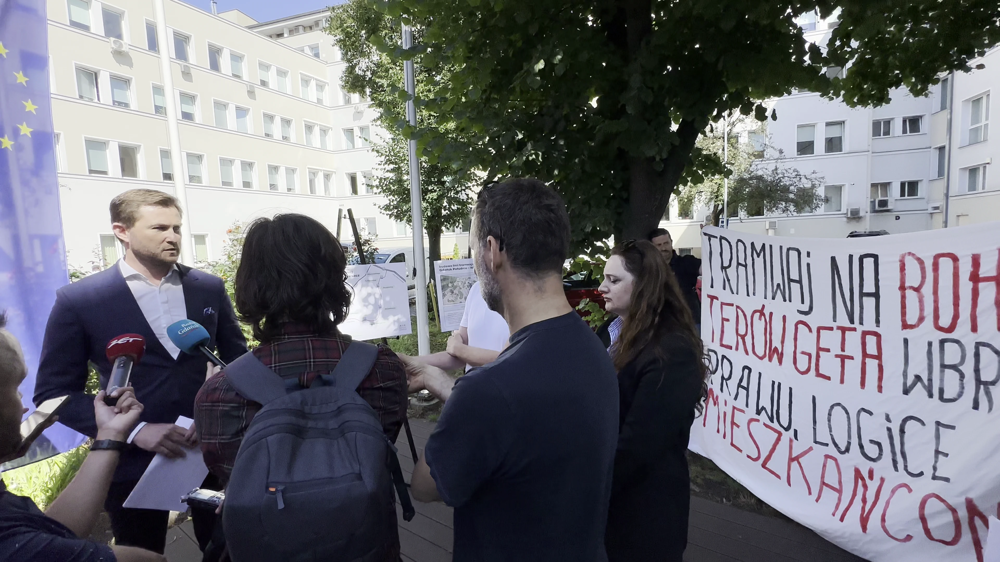

+++
title = '... o uzyskaniu dofinansowania na linię "Gdańsk-Południe - Wrzeszcz"'
date = '2024-07-14'
draft = false
tags = ['aktualnosci']
+++

Gdy miasto przedstawiło nowe szacunki kosztów budowy trasy GPW, potwierdziły się kolejne nasze obawy co do wariantu przez ul. Bohaterów Getta. Oprócz tego, że jest ona niebezpieczna dla zabytkowych kamienic, powolna i prowadzona na około, to jest jeszcze bardzo droga. Szacunkowe koszty, na podstawie których wskazano ten wariant jako najtańszy spośród kilku innych oceniach okazały się kolejnym oszustwem władz miasta. Budowa wariantu którą oszacowano w 2016 r. na 207 mln zł obecnie miałaby kosztować prawie 4 razy tyle. Uwzględniając wzrost cen w tym okresie, który szacuje się od 70 do 90%, wychodzi na to, że inwestycja i tak kosztuje dwukrotnie więcej niż planowano. To wynik m.in. dodania na etapie projektu nowych bardzo kosztownych elementów do projektu takich jak podziemny zbiornik retencyjny, którego wcześniej nie przewidywano. TO wszystko wskazuje, że o ile chcemy tą inwestycje ykonać dobrze musimy cofnąć się do etapu wyboru wariantu. Ale miasto tego nie chce zrobić.

<!--more-->

Planuje za to powołać Radę naukową projektu w momencie, gdy odebrany zostanie projekt wykonawczy i wszystkie kluczowe decyzje zostały już nie tylko podjęte alei zrealizowane.

Nie sposób nie podejrzewać, że tego typu "rada" będzie miała za zadanie zbijanie argumentów mieszkańców protestujących przeciwko budowie trasy przez ul. BGW i wspieranie akcji promocyjnej projektu. Kto wie, może nawet będzie finansowane ze środkó na promocję tramwaju przez Bohaterów Getta? W najlepszym razie eksperci zostaną postawieni przez włądze miasta przed faktem dokonanym, gdy nie będą mogli już zmianić kluczowych dla projektu decyzji. Dotychczasowe kontakty władz z niezależnymi ekspertami kończyły się ignorowaniem ich krytycznych opinii jak było w przypadku Koreferatu ekspertów z Politechniki Gdańskiej pod kierownictwem prom. Kazimierza Jamroza.

Władze miasta wiedzą doskonale że popełniły błąd lub dokonały świadomie złego wyboru, jednak brną dalej.

**Uświetniliśmy to spotkanie swoją obecnością**

**Postanowiliśmy też na tą okoliczność nagrać film**



**Natomiast w telegraficznym skrócie kilka faktów**
* Trasa w przebiegu planowanym przez miasto ma kosztować 800 mln złotych.
* Miasto ubiega się o dofinansowanie unijne w wysokości 260mln złotych. 
* Pozostała kwotę miasto planuje zabezpieczyć własnymi środkami (to jest kwotę 540mln złotych - przy rocznym budżecie miasta nie przekraczającym 5mld złotych)
* Dla porównania, niedawna inwestycja Nowa Warszawska była szacowana przez miasto na 15mln, wybrana oferta w przetargu opiewała na 35mln, a ostateczny koszt zamknął się w niecałych 60mln złotych. 
* Jeżeli założymy podobne błędy w szacowaniu to możemy przyjąć, że planowane 800mln złotych stanie się 1.6mld złotych w momencie przetargu i 3.2mld złotych po zakończeniu inwestycji. 1 MILIARD za kilometr. Dwukrotnie więcej niż koszt budowy metra w Warszawie. 
* Żaden z branych pod uwagę w 2016 roku wariantów - włączając inflację - nie zbliża się do tej kwoty.
* Miasto planuje powołać radę naukową / konsultacyjną - już po zakończeniu prac nad projektem wykonawczym. Czemu ma służyć jej powołanie, niestety nie wiemy. Możemy jednak spodziewać się podobnego traktowania co zespół naukowców Politechniki Gdańskiej, przygotowujący koreferat. 

Pochylmy się odrobinę nad wartością projektu. Przyjmując spojrzenie makroekonomiczne mamy kilka współczynników które pozwalają nasz oszacować zmianę wartości projektu na przestrzeni lat. Może to być skumulowana inflacja, wskaźnik cen produkcji budowlano-montażowej, wskaźnik cen dóbr produkcyjnych. Można też posłużyć się raportami branżowymi, takimi jak [Koszty w budownictwie 2016–2023](https://inzynierbudownictwa.pl/koszty-w-budownictwie-2016-2023/). Zmiana wynosi między 60% (infrastruktura kolejowa) a 80% (infrastruktura drogowa). **W żaden sposób nie uzasadnia to czterokrotnego wzrostu wartości projektu**

---

O wniosku o dofinansowanie napisały także media (cytując nas):
* trojmiasto.pl: https://www.trojmiasto.pl/wiadomosci/Nowa-Politechniczna-szacunkowy-koszt-800-mln-zl-n191251.html
* wbijamszpile.pl: https://wbijamszpile.pl/budowa-nowej-politechnicznej-pochlonie-800-mln-zl/ 
* Radio Gdańsk: https://radiogdansk.pl/wiadomosci/region/trojmiasto/2024/07/12/linia-tramwajowa-nowa-politechniczna-polaczy-gorny-taras-z-wrzeszczem-w-2029-roku/
* propaganda strona Miasta Gdansk: https://www.gdansk.pl/wiadomosci/Z-Moreny-do-Wrzeszcza-za-kilka-lat-pojedzie-tramwaj-Jest-wniosek-o-dotacje-na-inwestycje-z-budzetu-UE-Grzelak-Lemanski-Malkowski-DRMG,a,267622