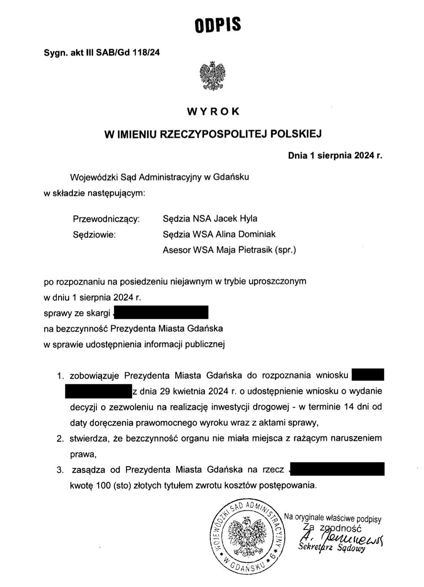
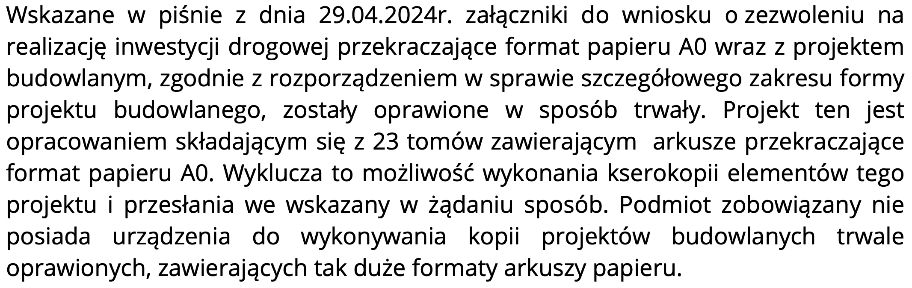
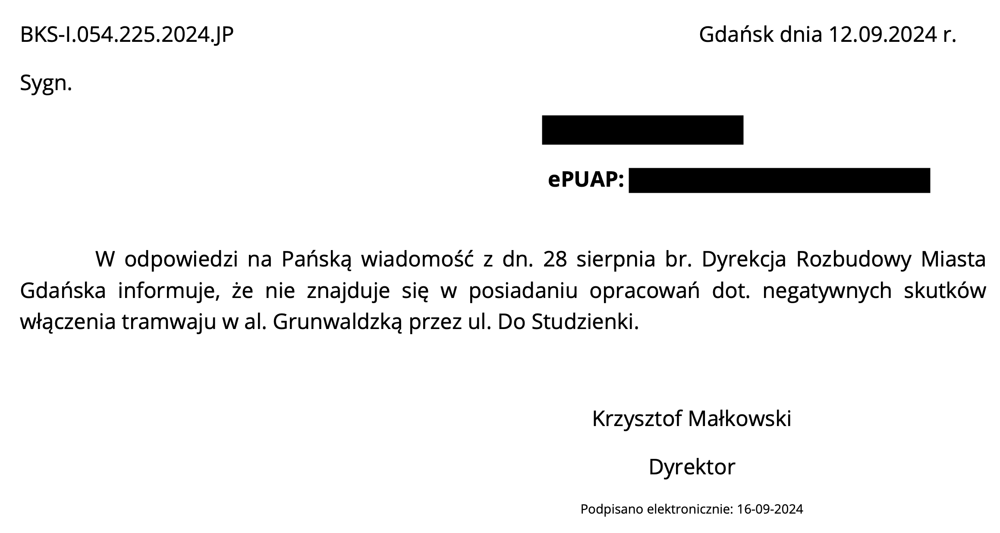
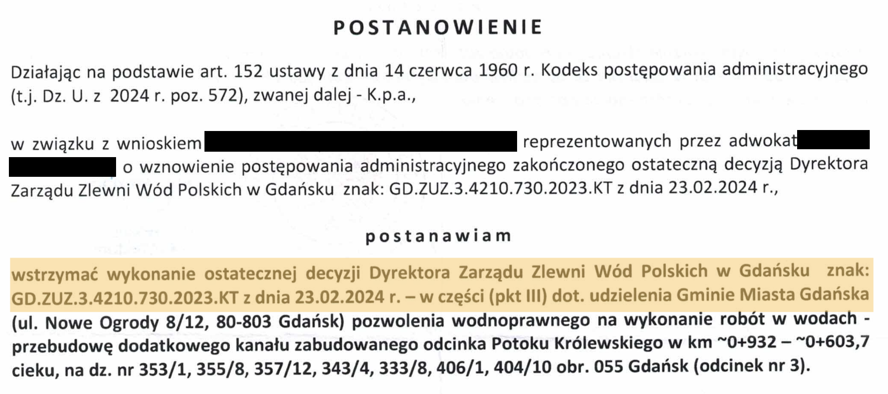
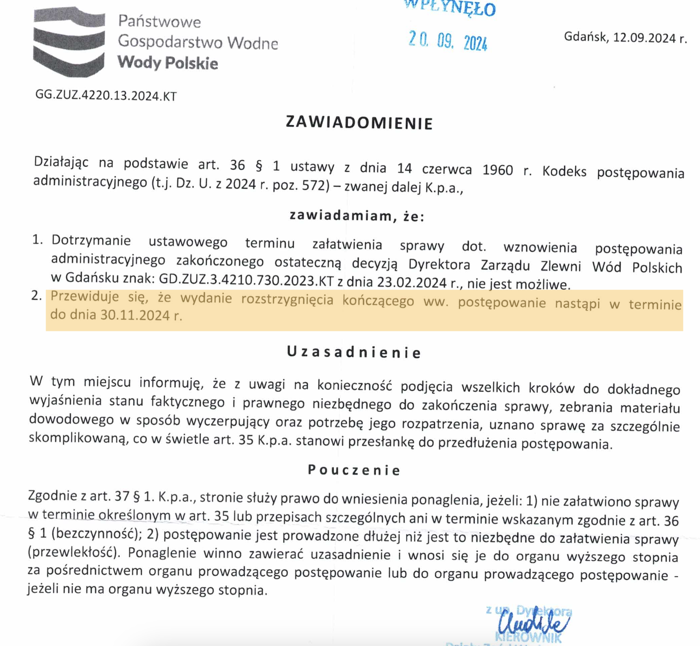
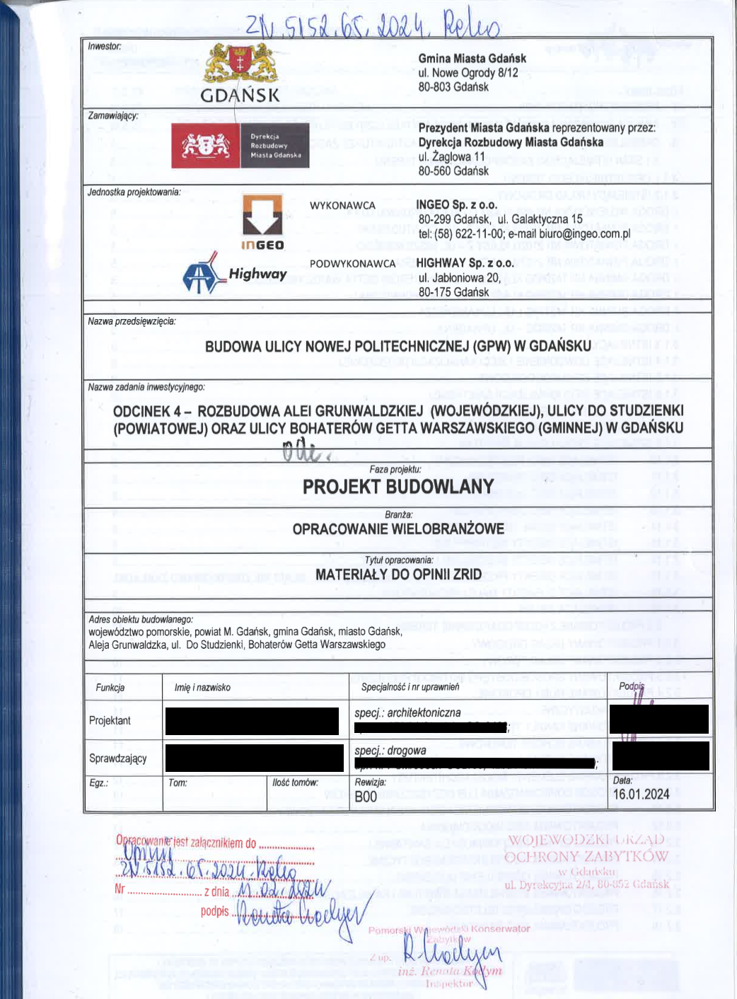

+++
title = '... o wstrzymaniu decyzji administracyjnych - konferencja prasowa'
date = '2024-09-24'
tags = ['aktualnosci', 'dokumentacja', 'konferencja prasowa']
+++

Przygotowanie trasy tramwajowej Gdańsk Południe - Wrzeszcz powoli hamuje!
Wojewódzki Sąd Administracyjny przyznał nam rację. Mieszkańcy przeciwni prowadzeniu tramwaju przez ulicę Bohaterów Getta Warszawskiego zaczynają wygrywać z miastem przed kolejnymi sądami i organami. 

<!--more-->

## Wygrana przed Sądem Administracyjnym

Pierwszego sierpnia sąd administracyjny przyznał nam rację. Potwierdził, że działania urzędu miasta ograniczające dostęp do dokumentacji i wniosków administracyjnych były bezprawne. Ograniczanie dostępu do dokumentów i praktyki które regularnie stosuje urząd miejski są niedopuszczalne - i potwierdza to prawomocny wyrok sądu. 
[Sygnatura: III SAB/Gd 118/24](https://orzeczenia.nsa.gov.pl/doc/9F89CDBA22)

Czy to zmienia sytuację mieszkańców Bohaterów Getta Warszawskiego? 
Nie bardzo - poza faktem że nawet Wojewódzki Sąd Administracyjny przyznał że ten słynny “dialog”, którym to zastępca prezydenta miasta Piotr Grzelak karmi nas i media, to fikcja i puste slogany.

Niestety, nawet po otrzymaniu wyroku sądu Urząd Miasta (Wydział Urbanistyki i Architektury) robi wszystko aby utrudnić mieszkańcom dostęp do dokumentów, na przykład udając że dokumenty ma tylko w formie papierowej, podczas gdy całość projektu budowlanego jest w wersji elektronicznej. 

Nie jest to ostatnia sprawa w kwestii bezczynności władz miasta, które zostały przez nas wniesione do sądu. Czekamy cierpliwie na kolejne terminy rozprawy, które potwierdzą że władze miasta nie posiadają dokumentów na które się powołują. Że analizy i opracowania o których regularnie mówi zastępca prezydenta miasta Piotr Grzelak nie istnieją. 
**Dyrekcja Rozbudowy Miasta Gdańska postanowiła być mądrzejsza i po prostu przyznała się że nie jest w posiadaniu opracowań dotyczących negatywnych skutków właczenia tramwaju w al. Grunwaldzką poprzez ul. Do Studzienki**. 

## Wstrzymanie pozwolenia na budowę zbiornika retencyjnego

To co jednak zmienia naszą sytuację to wiadomość z ubiegłego tygodnia. Dyrektor Wód Polskich w Gdańsku 12 września postanowił wstrzymać wykonanie wydanej przez siebie decyzji umożliwiającej przebudowę potoku królewskiego. To pozwolenie leży u podstawy wielu działań miasta, począwszy od pozwolenia na realizacji inwestycji, na pozyskaniu środków unijnych skończywszy. 

Ta “przebudowa” to w rzeczywistości budowa zupełnie nowego, większego obiektu hydrologicznego, pod ulicą na której się znajdujemy. Istniejący potok królewski to zamknięte koryto rzeki biegnące kilkanaście metrów stąd oraz rury o średnicy około metra która biegnie pod ulica, zabezpieczając tym samym okoliczne wieżowce przed podmyciem i zawaleniem. 
Pod przykrywką “przebudowy” Miasto Gdańsk planowało budowę zupełnie nowego, kilkukrotnie większego zbiornika retencyjnego, całkowicie betonując i rujnując naszą ulicę. Pisaliśmy [o szczegółach tego projektu już wcześniej]().

### Co to znaczy dla projektu tramwaju? 

Żadne pozwolenia administracyjne, opierające się o to pozwolenie, nie mogą się rozpocząć. Te procedury, które się już rozpoczęły, powinny zostać zawieszone. Odpowiednie osoby będą występować do właściwych organów z takimi wnioskami. 
Wody Polskie przychyliły się do naszych argumentów, uznały je za zasadne i wezwały do przedstawienia dodatkowych dokumentów, które świadczą o tym że budowa torowiska i zbiornika retencyjnego pod tymże, stanowi realne zagrożenie dla naszych kamienic.
Aż zastanawiające jest jakie dokumenty przedstawiło miasto, skoro takie “istotne elementy” zostały we wcześniejszych wnioskach pominięte. Ale to jest temat na odrębne wideo dotyczące oporu organów przed ujawnieniem szczegółów postępowań administracyjnych które prowadzą bądź prowadziły. 

## Kontrowersje podczas wydawania opinii konserwatorskiej

Wystąpienie przez władze miasta o decyzję wodną dla inwestycji, którą zaprojektowano całkiem inaczej niż zapowiadano w decyzji środowiskowej to nie jedyny skandal związany z dokumentacją trasy GPW.

Niedowierzanie budzi opinie pomorskiego wojewódzkiego konserwatora zabytków. Dlaczego? Kamienica przy ul Bohaterów Getta Warszawskiego 4, która  została ona wpisana do rejestru zabytków pod numerem A-1906, jest więc obiektem podlegającym ścisłej ochronie prawnej. Do ewidencji zabytków wpisana większość budynków przy naszej ulicy oraz przy ul. Politechnicznej i ul. Fiszera, a także w sąsiedztwie przy al. Grunwaldzkiej.  Tymczasem zgodnie z planami władz miasta, w bezpośrednim sąsiedztwie naszej kamienicy, w odległości 5 metrów od jej frontowej ściany przejeżdżać miałyby tramwaje. Wiadomo drgania są śmiertelnie niebezpieczne dla zabytkowych budynków zwłaszcza z drewnianymi stopami.   

Ale to nie wszystko bo głębokie wykopy, niosą za sobą zagrożenie katastrofą budowlaną dla kamienicy z rejestru zabytków. Jednym z takich zagrożeń opisanych przez inwestora w dokumentacji jest możliwość „przemieszczenia podłoża”, czyli po prostu osunięcia gruntów pod naszymi budynkami. Groźba ta została udokumentowana na otrzymanej przez nas od Dyrekcji Rozbudowy Miasta Gdańska mapie „Zasięg stref potencjalnego wpływu wykopu na tereny sąsiednie”. W strefie, gdzie może dojść do katastrofy budowlanej znajduje się właśnie wpisana do rejestru zabytków kamienica przy ul Bohaterów Getta Warszawskiego 4.

### Magicznie zmieniające się projekty budowlane

Z wydanej 15.02.2024 r. opinii konserwatora wystawionej dla Prezydenta Gdańska a złożonej przez władze miasta do Urzędu Wojewódzkiego wraz z wnioskiem o Zezwolenie na Realizację Inwestycji Drogowej wynika, że wyraża on pozytywną opinię dla realizacji trasy tramwajowej przez ul. Bohaterów Getta, a obiektowi wpisanemu do Rejestru zabytków w tej sytuacji przysługują jedynie dodatkowe badania archeologiczne w sąsiedztwie. Konserwator załączył do opinii stronę tytułową Projektu budowlanego / materiałów do opinii ZRID z dnia 16.01.2024 – rewizja B00, w oparciu, o którą konserwator wydał opinię do ZRIDu.

W otrzymanej przez nas pod koniec kwietnia dokumentacji projektowej znajdował się również Projekt budowlany / materiały oznaczony co ciekawe również jako rewizja B00 ale z datą 20.02.2024. W dokumentacji znajduje się mapa „Zasięg stref potencjalnego wpływu wykopu na tereny sąsiednie” ukazująca zagrożenie dla kamienic, która podobnie jak cały projekt jest datowana na 20.02.2024.

### Czy DRMG ukrywa dokumentację przed organami?

**Wariant 1** (wydawać się mógł prawdopodobniejszy, ale gdy okazało się że wszystkie dokumenty w projekcie budowlanym mają tą samą datę - można nabrać wątpliwości). 
Trudno wyobrazić sobie, żeby wobec tak wyartykułowanych zagrożeń konserwator nie podjął żadnych działań i nie poczynił w opinii jakichkolwiek zapisów zapobiegawczych. Jego ustawowym obowiązkiem jest ochrona zabytków a tu występowałby przypadek, w którym ze strony inwestora następuje powiadomienie, o tym że będzie stwarzał zagrożenie dla zabytku rejestrowego. 
W związku z tym mamy do czynienia z różnymi wersjami dokumentu, w którym ukryte zostać mogły przed konserwatorem niektóre dokumenty lub dodane mogły zostać na końcu i konserwator podjął decyzję o niepełną dokumentację. Widzimy, że władze miasta w procesie uzyskiwania kolejnych decyzji, podchodziły do projektu budowlanego wybiórczo, przekazując możliwie najmniej informacji potrzebnych do wydania decyzji.

### Czy konserwator zabytków celowo ignoruje zagrożenie zabytków?

**Wariant 2**: ski Wojewódzki Konserwator Zabytków nawet nie przejrzał dokumentów, ponieważ jest oddelegowywany do przyklepywania wszystkiego jak leci i jest powiązany z grupami czerpiącymi korzyści z realizowania inwestycji. Lekceważy obowiązki i nie planuje zapobiegać żadnym zniszczeniom zabytków, zwłaszcza gdy kolidują z inwestycjami. Błędna rewizja jest jedynie błędem formalnym wynikającym z niestaranności lub nawet celowo na wypadek gdyby coś się stało i trzeba byłoby rozmywać winę (za liczne wyburzenia zbytków przed 2016 r., obecny wojewódzki konserwator nie poniósł żadnych konsekwencji prawnych właśnie poprzez umiejętne rozmywanie odpowiedzialności - kompetencje odnośnie 90% zabytków scedował na miejskiego konserwatora, w taki sposób, że żaden z nich nie został ukarany).

[Pełna treść opinii konserwatora zabytków](PWKZ_Gdansk_pozytywna_opinia.pdf)

W obu przypadkach uważamy, że aktualna opinia powinna zostać wycofana. Zwracamy się więc do Pomorskiego Wojewódzkiego Konserwatora Zabytków z apelem o pójście śladem Wód Polskich, wycofanie pochopnej opinii ponowne rozpatrzenie sprawa z należytą starannością.

## Apel do prezydent Aleksandry Dulkiewicz

Chcielibyśmy po raz kolejny zwrócić się do Pani Prezydent Aleksandry Dulkiewicz o podjęcie dialogu z mieszkańcami. Chcemy rozmawiać bez zasłaniania się różnego typu pośrednikami, których kompetencje nie są wystarczające do podjęcia zasadniczej kwestii, czyli powrotu do wyboru wariantu trasy. Z każdym miesiącem widać coraz wyraźniej, że wybrany wariant jest mówiąc delikatnie niewłaściwy. Jest najdroższy, niekonkurencyjny, niebezpieczny, powolny i stwarza zagrożenie dla otoczenia. Jest już późno, ale być może nie za późno, żeby tą inwestycję przeprowadzić w sposób lepszy dla użytkowników i akceptowalny dla mieszkańców dzielnic, przez które tramwaje miałyby pojechać. Pani Aleksandro – naprawdę warto współpracować a nie walczyć z mieszkańcami w kwestiach ważnych. Udział społeczny, konsultacje to w Europie wymagania traktowane serio, a nie wyłącznie strategia marketingowa i budowa wizerunku. To znamienne, że tak ważna i kosztowna inwestycja jak trasa tramwajowa GPW nadal nie została skonsultowana społecznie. Czas to zmienić. 
