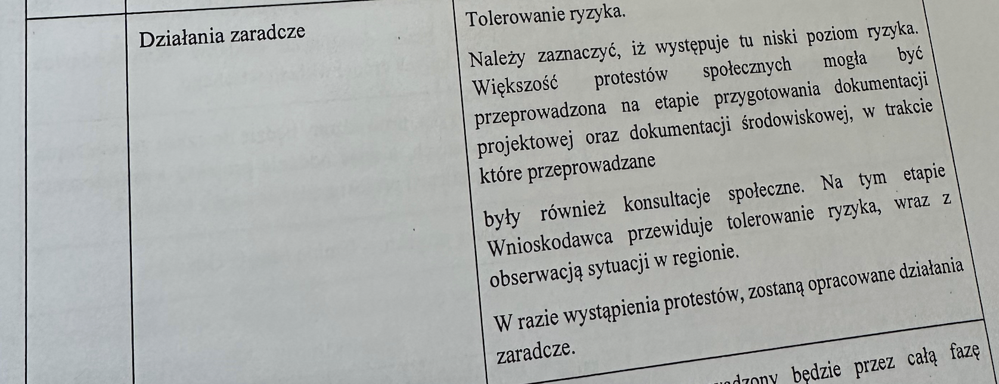

+++
title = '... o kłamstwach we wniosku unijnym i historii protestów mieszkańców w sprawie tzw. Nowej Politechnicznej'
date = '2024-12-01'
draft = false
tags = ['aktualnosci', 'historia', 'C U P T', 'dofinansowanie']
+++

Gmina Miasto Gdańsk, występując o dofinansowanie w ramach programy FENiKS, w sporządzonym wniosku zawarła szereg nieprawdziwych informacji, przedstawiając niezgodny ze stanem faktycznym obraz sytuacji społecznej związanej z planowaną inwestycją. Miasto Gdańsk nie uwzględniło i zataiło istnienie znaczącego, wieloletniego konfliktu społecznego dotyczącego planowanego przebiegu linii tramwajowej ulicą Bohaterów Getta Warszawskiego.

<!-- more -->

Mieszkańcy ulicy Bohaterów Getta Warszawskiego oraz okolicznych terenów od 2016 roku wyrażają stanowczy sprzeciw wobec tej części projektu, wskazując na jego liczne negatywne konsekwencje - m.in. urbanistyczne, środowiskowe oraz społeczne. Pominięcie tak istotnych okoliczności w dokumentacji projektowej narusza zasady transparentności, partycypacji społecznej oraz rzetelności, które są podstawą wnioskowania o dofinansowanie z funduszy unijnych.

W Studium wykonalności stworzonym przez firmę International Management Services z Krakowa w czerwcu 2024 jest rażące przekłamanie we fragmencie dotyczącym analizy „ryzyk politycznych” (Rozdział 14 “Analiza Ryzyka”). Dokument ten stwierdza, że w związku z realizacją inwestycji w fazie przygotowawczej nie występują protesty społeczne, które mogłyby powodować opóźnienia w realizacji projektu, a ryzyko ich pojawienia się określono jako niskie. Tymczasem rzeczywistość przeczy temu stwierdzeniu.

Protesty mieszkańców przeciwko przebiegowi linii tramwajowej ulicą Bohaterów Getta Warszawskiego są znane i udokumentowane od 2016 roku, czyli od samego początku fazy wariantowania projektu. Już na etapie analiz projektowych mieszkańcy wyrażali poważne zastrzeżenia podczas spotkań z przedstawicielami miasta, w petycjach oraz poprzez liczne wypowiedzi w mediach.

Protesty te nie były sporadycznymi incydentami, lecz trwałym konfliktem społecznym, wywołującym znaczące napięcia na linii mieszkańcy–władze miasta. Poniżej znajduje się skrócony opis przebiegu protestów przeciwko budowie linii tramwajowej przez ul. Bohaterów Getta Warszawskiego.

## Protesty mieszkańców

### Kwiecień 2016

**2 kwietnia**: Podczas trzeciego spotkania informacyjnego we Wrzeszczu (ul. Czarnieckiego, SP nr 17) odbyła się manifestacja z transparentami przeciwko przebiegowi trasy tramwajowej „slalomem” i przez ul. Bohaterów Getta Warszawskiego. W trakcie spotkania odczytano komunikat obywatelski zatytułowany: „Informacja dla Władz Gdańska Nr 1”. Było to jedno z pierwszych publicznych wyrażenie sprzeciwu wobec planowanej inwestycji

**20 kwietnia**: 737 mieszkańców Gdańska skierowało pismo do Prezydenta Miasta Gdańska Pawła Adamowicza, artykułując sprzeciw wobec realizacji trasy tramwajowej wzdłuż ul. Bohaterów Getta Warszawskiego. Dokument wpłynął 27 kwietnia 2016 roku i został przekazany do wiadomości kluczowych osób i instytucji: Marszałka Województwa Pomorskiego, Wojewody Pomorskiego, Przewodniczącego Rady Miasta Gdańska, Pomorskiego Wojewódzkiego Konserwatora Zabytków, Miejskiego Konserwatora Zabytków, dyrektora Biura Rozwoju Gdańska oraz dyrektora Dyrekcji Rozbudowy Miasta Gdańska.

### Maj 2016

Protest mieszkańców dzielnicy Piecki-Migowo oraz ulicy Wileńskiej został skierowany do
Prezydenta Miasta Gdańska. Dokument podpisało 147 osób.

Protest popiera środowisko naukowe - Instytut Maszyn Przepływowych PAN wysłał pismo protestacyjne do Dyrekcji Rozbudowy Miasta Gdańska (DN/1057/2016), przekazane również do wiadomości Prezydenta Miasta Gdańska, Biura Rozwoju Gdańska, rektora Politechniki Gdańskiej, ZTM Gdańsk oraz Wydziału Programów Rozwojowych Urzędu Miasta.

### Lipiec 2016

**13 lipca** powstało Stowarzyszenie „Dolina Królewska”, mające na celu reprezentowanie
interesów mieszkańców i koordynację działań przeciwko inwestycji.

**22 lipca** DRMG skierowała pismo do Wydziału Inżynierii Lądowej i Środowiska Politechniki Gdańskiej (WILiŚ PG), prosząc o usunięcie fragmentów zamówionego koreferatu, dotyczących analizy wielokryterialnej wariantów tramwajowych. Wspomniane rozdziały odnosiły się do istniejącego “konfliktu z lokalną społecznością mieszkańców ul. Bohaterów Getta Warszawskiego”, co zdaniem DRMG nie powinno znaleźć się w dokumencie o charakterze publicznie dostępnym.

### Grudzień 2016

**12 grudnia** do Urzędu Miasta Gdańska wpłynął protest podpisany przez 776 mieszkańców.

### Grudzień 2018

**20 grudnia** roku do Regionalnej Dyrekcji Ochrony Środowiska (RDOŚ) wpłynął protest mieszkańców,  dokument podpisany przez 776 mieszkańców, wpłynął 20 grudnia 2018 r.

### Luty 2020

**4 lutego** złożono odwołanie do Generalnej Dyrekcji Ochrony Środowiska (GDOŚ) od decyzji RDOŚ dla Wariantu Fioletowy 2 (przez ul. Do Studzienki). Odwołania te były składane przez przedstawicieli społeczności lokalnej.

Kolejnym niezaprzeczalnym dowodem potwierdzającym istnienie oraz skalę konfliktu społecznego, związanego z budową trasy tramwajowej przez ul. Bohaterów Getta Warszawskiego są spory sądowe prowadzone między Stowarzyszeniem „Dolina Królewska” a Miastem Gdańsk. 

### Wrzesień 2024

**19 września** mieszkańcy ulicy Bohaterów Getta Warszawskiego doprowadzili do wstrzymania decyzji pozwalającej miastu budowę zbiornika retencyjnego pod ulicą, tym samym wstrzymując inwestycję do czasu ponownego rozpatrzenia dokumentacji i odwołań przedstawionych przez mieszkańców.

## Działania na gruncie prawnym sądowe

Kolejnym niezaprzeczalnym dowodem potwierdzającym istnienie oraz skalę konfliktu społecznego, związanego z budową trasy tramwajowej przez ul. Bohaterów Getta Warszawskiego są spory sądowe prowadzone między Stowarzyszeniem „Dolina Królewska” a Miastem Gdańsk:

### Skarga do Generalnego Dyrektora Ochrony Środowiska

**20 maja 2022 r.** stowarzyszenie „Dolina Królewska” złożyło skargę do Generalnego Dyrektora Ochrony Środowiska, kwestionując decyzje środowiskowe dotyczące inwestycji (sygnatura sprawy: DOOS-DŚZOO.420.20.2020.KM/KB.30, wcześniej DOOS-WDS/ZOO.420.48.2020.aka). Czemu zaświadcza [zawiadomienie organu o przekazaniu skargi](2022-05-20_GDOS_przekazanie_do_WSA.pdf)

### Postępowanie przed Wojewódzkim Sądem Administracyjnym (WSA)

Sygnatura akt: **IV SA/Wa 878/22**

Status: Sprawa została zakończona - [sentencja wyroku WSA](2022-07-28_wyrok_WSA.pdf)

### Postępowanie przed Naczelnym Sądem Administracyjnym (NSA)

Sygnatura akt: **III OSK 646/23** - [treść skargi](2022-11-14_skarga_kasacyjna_NSA.pdf)

Status: Sprawa pozostaje nierozpatrzona. Mieszkańcy zgłaszają zażalenia na brak działań w sprawie.
Dokumentacja: Szczegóły postępowania są dostępne tutaj.

## Działania społeczne

Należy również mieć na uwadze, że protesty mieszkańców przeciwko budowie trasy tramwajowej przez ul. Bohaterów Getta Warszawskiego są od wielu lat obecne w doniesieniach medialnych, które wskazują na długotrwałość i temperaturę konfliktu społecznego wokół tej inwestycji. Media lokalne (m.in. portal trójmiasto.pl, Radio Gdańsk, Wyborcza.pl Trójmiasto, TVP Gdańsk, Inna Telewizja, Zawsze Pomorze) regularnie informują o sprzeciwie mieszkańców, ich obawach dotyczących bezpieczeństwa budynków - a tym samym bezpieczeństwa życia i zdrowia ich lokatorów, braku konsultacji społecznych, a także alternatywnych propozycjach tras. Liczne artykuły, relacje wideo oraz aktywność mieszkańców w mediach społecznościowych potwierdzają, że problem ten jest szeroko nagłaśniany i budzi duże zainteresowanie opinii publicznej. Protesty można też dostrzec gołym okiem - na ulicy Bohaterów Getta Warszawskiego od miesięcy wiszą transparenty i banery przeciwko budowie. Miasto usunęło część z nich, tłumacząc, że były zawieszone niezgodnie z prawem. 

Organizowane są też spotkania mieszkańców oraz festyny, podczas których dyskutowana jest inwestycja, jej potencjalne konsekwencje a także możliwości przeciwdziałania decyzjom miasta. Mieszkańcy zwołują konferencje prasowe, które mają na celu zwrócenie uwagi opinii publicznej i władz miasta na istotne problemy i zagrożenia związane z inwestycją. 20 czerwca 2024 r. przedstawiciele Stowarzyszenia wystąpili na Radzie Miasta Gdańska, gdzie kolejny raz przedstawili swoje stanowisko w sprawie budowy trasy tramwajowej przez ulicę Bohaterów Getta Warszawskiego.

Ponadto zauważyć trzeba, że w Tabeli 24 “Ryzyka polityczne” zamieszczono kolejną nieprawdziwą informację, jakoby zostały przeprowadzone konsultacje społeczne. 

Tymczasem Miasto Gdańsk przez cały czas trwania projektu nie przeprowadziło konsultacji społecznych, dotyczących przebiegu trasy tramwajowej, pomimo regularnego powoływania się na inne wydarzenia jako rzekome konsultacje w ramach tego projektu. Władze miasta odwołują się m.in. do warsztatów organizowanych przez Biuro Architekta Miasta Gdańska w 2022 roku, spotkań informacyjnych z mieszkańcami z 2016 roku oraz konsultacji dotyczących innych inwestycji w 2015 roku, jak wyburzenia kamienic przy ul. Do Studzienki. Jednak działania te nie spełniały definicji konsultacji społecznych zgodnie z uchwałą Rady Miasta Gdańska nr XVI/494/15 z dnia 26 listopada 2016 roku. W szczególności, miasto nie odniosło się do uwag mieszkańców, nie sporządzono raportu podsumowującego, który zawierałby informacje o sposobie ustosunkowania się Prezydenta do opinii mieszkańców, ani nie opublikowano takiego raportu na stronach internetowych Urzędu Miasta. Takie działanie nagina przepisy dotyczące konsultacji społecznych, które powinny być transparentne i uwzględniać głosy społeczności lokalnej.

Więcej można przeczytaj w naszej notce [o historii "spotkań informacyjnych" w sprawie tzw. Nowej Politechnicznej]().
