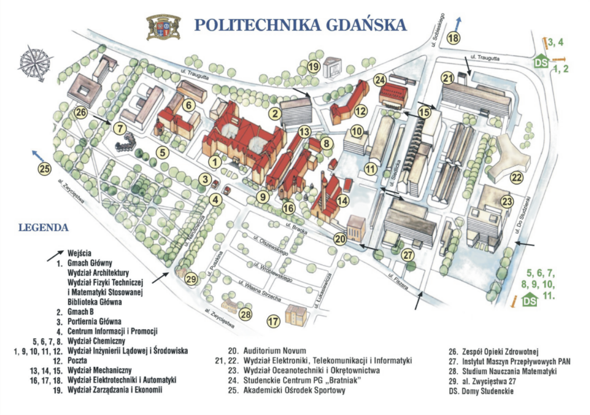

+++
title = '... o kłamstwach we wniosku unijnym i wprowadzaniu kolejnych organów w błąd przez Miasto Gdańsk'
date = '2025-03-15'
tags = ['aktualnosci', 'historia', 'C U P T', 'dofinansowanie']
+++

W odpowiedzi na zarzuty mieszkańców, CUPT wystąpił o stanowisko do Wnioskodawcy dofinansowania – Urzędu Miejskiego w Gdańsku. UM Gdańsk zrobił to co umie najlepiej, pominął fakty, przeinaczył i kręcił. Aż trudno pozostawić to bez komentarza. 

<!-- more -->

Inwestor (Gmina Miasta Gdańsk) pominął istotny udział społeczeństwa w procesie projektowym, forsując wybrany przez siebie wariant na podstawie niejasnych i nieprecyzyjnych kryteriów. Jego działania charakteryzowały się rażącym brakiem transparentności, ukrywaniem informacji kluczowych dla mieszkańców oraz ograniczeniem konsultacji z mieszkańcami do wymaganego prawem minimum.  

Okazało się, że jedna z odpowiedzi którą otrzymaliśmy (na najpełniejsza) dotycząca “Gdańskiego Projektu Komunikacji Miejskiej etap VA – budowa linii tramwajowej Gdańsk Południe – Wrzeszcz” (FENX.03.01-IP.02-0029/24) - [oryginalny dokument](20250212-wniosekCUPT-odp_redacted.pdf) nie odnosi się do wielu podniesionych przez nas argumentów, wskazujących na niezgodny ze stanem faktycznym obraz sytuacji społecznej, przedstawiony w projekcie zgłoszonym przez Miasto Gdańsk w ramach wniosku o dofinansowanie ze środków Unii Europejskiej. Udzielona odpowiedź zawiera za to liczne nieprawdziwe informacje, z którymi nie sposób się zgodzić.

## Spotkania informacyjne nie konsultacje

> Należy również uwzględnić fakt, że w piśmie wyjaśniającym Wnioskodawca przekazał, że na etapie planowania inwestycji przeprowadzono dodatkowo konsultacje społeczne w formie spotkań, dotyczące budowy trasy tramwajowej Gdańsk Południe - Wrzeszcz. Spotkania zorganizowane zostały w następujących terminach:
> * 17.03.2016 – w XX LO przy ul. Dobrowolskiego 6 w Gdańsku,
> * 05.04.2016 - w Pomorskich Szkołach Rzemiosł przy ul. Sobieskiego 90 w Gdańsku,
> * 12.04.2016 - w Sali gimnastycznej SP 17 przy ul. Czarnieckiego w Gdańsku,
> * 20.04.2016 – w stołówce szkolnej ZKPiG 2 przy ul. Stolema 59 w Gdańsku,
> * 27.04.2016 – w Sali gimnastycznej SP 12 przy ul. Człuchowskiej 6 w Gdańsku.

Nie można uznać przywołanych spotkań za konsultacje społeczne, o czym informowaliśmy organ już w czerwcu 2024 r. (korespondencja Jakuba Marchwickiego, znak sprawy w MFiPR: DPI-XVII.6911.3.43.2024.BK). Uzasadnienie tej kwestii przedstawiliśmy w artykule dostępnym pod adresem: https://mieszkancybgw.pl/aktualnosci/2024-06-30_historia_spotkan_z_mieszkancami/.

Niezależnie od wcześniej podnoszonych argumentów, należy podkreślić, że zgodnie z informacjami organizatorów, spotkania miały charakter wyłącznie informacyjny, a same konsultacje były na nich jedynie zapowiadane. Tryb i sposób przeprowadzania konsultacji społecznych w Gdańsku regulowany jest uchwałą Rady Miasta, której wymogów te spotkania nie spełniły.

Przykłady spotkań o charakterze informacyjnym:
* https://youtu.be/PpE1Ti2414A?feature=shared&t=255 – Szkoła Rzemiosł, 05.04.2016 r., minuta 04:20,
* https://youtu.be/PpE1Ti2414A?feature=shared&t=4338 – Szkoła Rzemiosł, 05.04.2016 r., godzina 1:12:16,
* https://youtu.be/0wI-c6uNS6Y?feature=shared&t=135 – SP17, 12.04.2016 r., minuta 2:15.

Zgodnie z uchwałą nr XVI/494/15 Rady Miasta Gdańska z dnia 26 listopada 2015 r. prawidłowo przeprowadzone konsultacje powinny spełniać następujące wymagania:
* jasno określony inicjator konsultacji (§5),
* odpowiednie uchwały lub zarządzenia Prezydenta w zależności od wnioskującego (§6, §7, §9 pkt 6 uchwały),
* ustalony regulamin konsultacji (§11),
* ogłoszenie konsultacji zgodnie z uchwałą (§13),
* przeprowadzenie konsultacji w co najmniej dwóch formach (§14),
* sporządzenie i upublicznienie raportu końcowego (§16).

Żadne z wymienionych wymagań nie zostało spełnione w przypadku omawianych spotkań. Co więcej, organ przyznał, że raporty ze spotkań nie były publikowane, a pytania mieszkańców nie zbierano i nie opracowywano (por. [odpowiedź organu na zapytanie o spotkania](https://mieszkancybgw.pl/aktualnosci/2024-06-30_historia_spotkan_z_mieszkancami/DRMG_raporty_ze_spotkan-wniosek.pdf) – pytania 
oraz [odpowiedź organu](https://mieszkancybgw.pl/aktualnosci/2024-06-30_historia_spotkan_z_mieszkancami/DRMG_raporty_ze_spotkan.pdf)). 

Jeśli zdaniem organu pytania mieszkańców i odpowiedzi urzędu stanowią informację przetworzoną, której udostępnienie wymaga ponadstandardowej pracy, oznacza to, że w latach 2016–2024 wątpliwości mieszkańców nie były przedmiotem szczególnego zainteresowania Urzędu Miasta.

Informację tę potwierdza też Urząd Miejski w odpowiedzi na zapytanie, stwierdzając że przekazując “informację do Centrum Unijnych Projektów Transportowych, mieliśmy na myśli przeprowadzone spotkania informacyjne”, a “charakter przeprowadzonych spotkań z mieszkańcami w 2016 roku nie wynikał z przywołanej na wstępie pisma Uchwały Rady Miasta Gdańska, wobec tego dokumenty (jak regulamin konsultacji, raport podsumowujący konsultacje) nie zostały wytworzone” (por. [odpowiedź organu](87800_odp_01.pdf) na [zapytanie o informację publiczną 190/2025](87800_wniosek.pdf)) 

Zatem w świetle powyższego, spotkania wskazane przez Urząd Miasta nie mogą zostać uznane za konsultacje społeczne. Trudno również przyjąć za wiarygodne twierdzenie, że „Uwagi mieszkańców posłużyły Inwestorowi do podjęcia decyzji dotyczącej wyboru wariantu przebiegu planowanej inwestycji, jak również wykorzystane zostaną w przyszłości do sporządzenia Projektu Budowlanego” (por. decyzja RDOŚ RDOŚ-Gd-WOO.4207.15.2017AT.40), skoro Inwestor nie dysponuje rzetelnym raportem ani katalogiem uwag mieszkańców, które byłyby zebrane w jakikolwiek sformalizowany sposób. Nasuwa się raczej wniosek, że mieszkańcy podczas spotkań zostali potraktowani instrumentalnie, a spotkania były mistyfikacją mającą na celu legitymizację przyjętego a-priori wariantu.   

## Konsultacje w trakcie postępowania o decyzję środowiskową

> Decyzja RDOŚ w Gdańsku nr RDOŚ-Gd-WOO.4207.15.2017.AT.40 z dnia 23.12.2019 r. - zgodnie z uzasadnieniem decyzji, w dniach 20.11 – 20.12.2018 zapewniono możliwość udziału społeczeństwa w ramach przepisów wynikających z Art. 79 Ustawy OOŚ, przed wydaniem Decyzji o środowiskowych uwarunkowaniach. W postępowaniu z udziałem społeczeństwa do RDOŚ w Gdańsku wpłynęło 128 pism z wnioskami i uwagami dotyczącymi niniejszego projektu (str. 25 – 26 DŚU). Organ poinformował społeczeństwo o wydaniu decyzji obwieszczeniem nr RDOŚ-Gd-WOO.4207.15.2017.AT.41 z dnia 23.12.2019 r.

> W wyniku analizy przekazanego materiału można uznać, że społeczeństwo zostało poinformowane o wydaniu decyzji administracyjnych w sposób zgodny z obowiązującymi przepisami, co także zostało opisane w uzasadnieniu do decyzji GDOŚ z dn. 03.03.2024.

Przywoływanie udziału społeczeństwa na etapie decyzji środowiskowej nie jest jedynym  przykładem usiłowania ukrycia przez Urząd Miejski w Gdańsku braku konsultacji dotyczących przebiegu trasy tramwajowej z mieszkańcami. Udział społeczeństwa powinien odnosić się nie tylko do kwestii środowiskowych, ale także urbanistycznych (przebieg trasy i wariantowanie), kulturowych (ochrona zabytków) oraz społecznych (ryzyka inwestycyjne, bezpieczeństwo, ruch drogowy). Konsultacje społeczne nie polegają jedynie na informowaniu o podjętych decyzjach, lecz na umożliwieniu mieszkańcom aktywnego udziału w procesie decyzyjnym oraz uwzględnieniu ich uwag.

Nie można uznać, że udział społeczeństwa przewidziany w art. 79 ustawy OOŚ spełnia tę przesłankę. 

* Możliwość zgłaszania uwag w ramach tego przepisu nie zastępuje rzeczywistych konsultacji społecznych, a przy tym ogranicza tematykę do kwestii środowiskowych (zakres tematyczny), obejmuje jedynie określone grupy podmiotów (zakres podmiotowy) i odbywa się na późnym etapie procesu projektowego, kiedy kluczowe decyzje zostały już podjęte. 
* Procedura przewidziana w art. 79 ustawy ogranicza się do możliwości składania uwag i wniosków w określonym czasie, nie wymaga organizowania debat publicznych, warsztatów czy innych form aktywnego dialogu, które stanowią standard prawidłowo przeprowadzonych konsultacji społecznych. Ponadto ogranicza dostęp do procedury zgłaszania uwag osobom spoza grona stron postępowania, a same zgłoszenia odnoszą się wyłącznie do wybranego wariantu trasy, co uniemożliwia podjęcie pogłębionej i wielowymiarowej dyskusji w kwestii jej przebiegu. Tę interpretację potwierdzały zarówno organy pierwszej, jak i drugiej instancji.
* W postępowaniu administracyjnym dotyczącym wydania decyzji środowiskowej dialog społeczny ograniczony jest do ściśle określonych warunków środowiskowych, które reglamentują możliwość realizacji inwestycji w danym obszarze. Stanowisko to znajduje potwierdzenie w orzecznictwie sądów administracyjnych (por. wyrok WSA w Lublinie z dnia 6 czerwca 2023 r., sygn. II SA/Lu 285/23).

## Opinie eksperckie na temat projektowanej trasy

> RDOŚ potwierdził również, iż koreferat przygotowany przez Politechnikę Gdańską nie został sporządzony rzetelnie i nie uwzględnił przyjętych kryteriów przez Inwestora.

W związku z twierdzeniem wnioskodawcy dotyczącym koreferatu, należy odnieść się do stanowiska organu, RDOŚ, wyrażonego na stronie 49 decyzji RDOŚ-Gd-WOO.4207.15.2017AT.40. Stwierdzono w niej, iż koreferat nie przeprowadził rzetelnej oceny analizy wielokryterialnej, a nie że został on sporządzony nierzetelnie. Jak wskazano w treści decyzji: „(Zespół Politechniki) nie przeanalizował jej (oceny wielokryterialnej - dopisek AG) prawidłowości, a przez to nie potwierdził lub nie zanegował jej wyników. Odnosząc się w koreferacie do tego typu opracowań, należy przede wszystkim sprawdzić, czy przy przyjętych kryteriach (i ich wagach) prawidłowo oceniono poszczególne warianty, a co za tym idzie – prawidłowo wskazano wariant najkorzystniejszy. Można wprawdzie wskazywać lub sugerować dodatkowe kryteria oceny, jednak należy mieć na uwadze, że w tym zakresie brak jest wiążących wytycznych, a dobór kryteriów oparty jest na doświadczeniu zespołu projektowego w uzgodnieniu z inwestorem. Zespół Politechniki nie dokonał rzetelnej oceny wybranych kryteriów. W zamian zaproponował inny zestaw kryteriów, obejmujący elementy nieuwzględnione w toku ustaleń z inwestorem oraz nowe kryteria, oparte na zmodyfikowanych modelach ruchowych.”

Tym samym nieuprawnione jest twierdzenie o braku rzetelności koreferatu, co znajduje potwierdzenie w decyzji organu II instancji (GDOŚ, DOOŚ-WDŚZOO.420.20.2020.KM/KB.26, s. 48). Warto podkreślić, że zgodnie z treścią zamówienia koreferat stanowi odrębne, kompleksowe opracowanie, oferujące całościowe spojrzenie na analizę budowy trasy tramwajowej, a nie jedynie ocenę analizy wielokryterialnej sporządzonej na zlecenie Miasta Gdańska. Jak wskazano w pkt 1.2 [koreferatu](https://mieszkancybgw.pl/kalendarium/2016-07-01_koreferat_politechniki_gdanskiej/01_Opis/01_Korefert_Raport.pdf): „Celem niniejszego opracowania jest wykonanie kompleksowej analizy skrzyżowania ulic Grunwaldzka – Miszewskiego – Do Studzienki, przy założeniu wprowadzenia linii tramwajowej w dwóch wariantach:
* w lewo w kierunku dworca we Wrzeszczu,
* na wprost w kierunku Placu Komorowskiego, wraz ze wskazaniem odcinków układu drogowego niezbędnych do realizacji wraz z układem tramwajowym.” 

Zgodnie z decyzją GDOŚ, koreferat stanowi odrębne opracowanie wariantów, a dobór wag w analizie wielokryterialnej ma charakter subiektywny. Potwierdza to również [stanowisko inwestora, wyrażone w piśmie z lipca 2016](https://mieszkancybgw.pl/kalendarium/2016-07-01_koreferat_politechniki_gdanskiej/DRMG-koreferat20160722.pdf), w którym podkreślono rozbieżności w ocenie koreferatu oraz wskazano na konieczność pominięcia niektórych jego fragmentów ze względu na potencjalne konflikty społeczne. Podkreślić należy, że powyższe kwestie nie mogą podważać rzetelności i wartości koreferatu oraz dostarczonego przezeń alternatywnego spojrzenia na trasę, pominiętego przez inwestora. 

Zatem - jak wskazuje decyzja organu środowiskowego oraz utrwalone orzecznictwo - decyzja środowiskowa odnosi się do aspektów środowiskowych, a nie całościowego przebiegu trasy, który stanowił przedmiot koreferatu. Mając to na uwadze, należałoby oczekiwać, aby organ odpowiedzialny za decyzję o dofinansowaniu inwestycji przyjął podejście holistyczne, uwzględniające szeroką perspektywę projektu – w tym analizę ryzyka oraz zasadność wykorzystania środków unijnych - w szerszym zakresie niż forsowany przez Miasto Gdańsk.

## Najlepiej punktowany wariant przez ulicę Do Studzienki

> Ponadto, zgodnie z informacją od Wnioskodawcy, mieszkańców ul. Bohaterów Getta Warszawskiego wielokrotnie informowano, iż wariant prowadzenia tramwaju w ul. Do Studzienki jest mniej korzystny ze względów komunikacyjnych

Nie jest zgodne z prawdą twierdzenie, że mieszkańcy byli wielokrotnie informowani o korzyściach wariantu przebiegu trasy przez ul. Bohaterów Getta Warszawskiego. Wypowiedzi przedstawicieli Urzędu Miasta nie były poparte żadnymi analizami czy badaniami, co nie pozwala uznać ich za wiążące. Stanowią one jedynie opinie indywidualne, formułowane przez osoby niemające kompetencji w zakresie urbanistyki, zarządzania ruchem czy transportu (wiceprezydent Piotr Grzelak - absolwent wydziału Nauk Społecznych, dyrektor Krzysztof Małkowski - absolwent politologii i marketingu). 

W odpowiedzi na zapytanie dotyczące podstaw tych informacji organ przyznał, że nie posiada żadnych opracowań potwierdzających prawdziwość przedstawianych tez ([zapytanie](https://mieszkancybgw.pl/aktualnosci/2024-12-01_historia_protest/20240828-wniosek.pdf) i [Odpowiedź organu](https://mieszkancybgw.pl/aktualnosci/2024-12-01_historia_protest/20240916-brak_informacji_do_studzienki.pdf)

W związku z powyższym nie można uznać, że mieszkańcy byli wielokrotnie rzetelnie informowani, ponieważ przedstawiane im informacje okazały się bezpodstawne. Podobna sytuacja miała miejsce w przypadku innych deklaracji składanych na etapie przygotowywania inwestycji, m.in.:
* wypowiedzi Prezydenta o wyborze najlepszego wariantu – wniosek o wydanie decyzji środowiskowej dla wariantu przez ul. Do Studzienki został wycofany przez miasto;
* deklarowana częstotliwość (takt) kursowania tramwajów – pierwotnie zapowiadana jako „co pięć minut”, podczas gdy we wniosku unijnym określono ją na 100 sekund;
* rezygnacja z trakcji tramwajowej na rzecz tramwajów bateryjnych w celu zachowania charakteru ulicy;
* zapewnienie mieszkańcom parkingu wielopoziomowego w miejscu Domu Handlowego Jantar – obecnie planowanego do wyburzenia i zastąpienia zabudową wielorodzinną.

Wobec tego mieszkańcy podchodzą do składanych deklaracji i opinii przedstawicieli Urzędu Miasta z uzasadnioną rezerwą.

## Ochrona zabytków

> Ponadto, wariant alternatywny wiązałby się z naruszeniem tkanki zabytkowej miasta, szczególnie kilku budynków należących do „Zespołu zabytkowego Politechniki Gdańskiej”, który jest wpisany do rejestru zabytków pod numerem 828 decyzją Wojewódzkiego Konserwatora Zabytków w Gdańsku z dnia 30 kwietnia 1979 r. – obecnie pod numerem 969 rejestru zabytków nieruchomych woj. Pomorskiego (str. 51 w raporcie).

Wspomniane wyburzenia zabytkowych kamienic to kolejny przykład manipulacji ze strony Urzędu Miasta, zasługujący na szczegółowe wyjaśnienie. Początkowe wyburzenia, o których mowa, dotyczyły wstępnych koncepcji z 2016 roku, obejmujących m.in. rozbiórkę wschodniej pierzei ulicy na odcinku od ul. Traugutta do al. Grunwaldzkiej. ([odpowiedź miasta](https://mieszkancybgw.pl/aktualnosci/2024-12-01_historia_protest/2024-08-05_drmg_wybor_wariantu.pdf)) Propozycje te spotkały się z krytyką ze strony Forum Rozwoju Aglomeracji Gdańskiej (FRAG) oraz mieszkańców, [co znajduje odzwierciedlenie w dokumentacji](https://mieszkancybgw.pl/aktualnosci/2024-12-01_historia_protest/2024-08-05_drmg_wybor_wariantu.pdf).

FRAG przedstawił alternatywną propozycję przebiegu trasy tramwajowej (https://frag.org.pl/portfolio/nowapolitechniczna/), jednak nie została ona uwzględniona przez miasto. W opinii FRAG, proces projektowy odbył się bez faktycznego udziału opinii publicznej, co podważa standardy współczesnego planowania przestrzennego: “Po ponad trzech latach od prezentacji naszej alternatywnej wizji ul. Nowej Politechnicznej, działania miasta można ocenić jako sprawne zagranie polityczne, a opinia publiczna została wyłączona z wstępnego procesu przygotowania inwestycji. Nie ma konsultacji społecznych, nie ma konfliktu. Pytanie o to czy tak powinny wyglądać współczesne standardy planowania przestrzennego pozostawiamy jako retoryczne.”

W odniesieniu do sytuacji mieszkańców, według dokumentacji, w budynkach przewidzianych do wyburzenia znajdowało się 58 lokali mieszkalnych, w których zameldowanych było 131 osób. Jednocześnie inwestor nie dysponuje precyzyjnymi danymi dotyczącymi aktualnego zamieszkania tych nieruchomości, a Gdańskie Nieruchomości [odmówiły udostępnienia informacji na temat pustostanów, argumentując to względami bezpieczeństwa publicznego](https://mieszkancybgw.pl/aktualnosci/2024-12-01_historia_protest/20241108-GN-pustostany_mieszkalne.pdf). Z wizji lokalnej wynika natomiast, że budynki są sukcesywnie opuszczane, głównie ze względu na ich stan techniczny.

| Lokalizacja | Projekt 2016 | Projekt 2025 | Budynek zamieszkały |
| --- | --- | --- | --- |
| Do Studzienki 30 | wyburzenie | wyburzenie |  Pustostan |
| Do Studzienki 24 | wyburzenie | wyburzenie | Pustostan |
| Do Studzienki 22 | wyburzenie | wyburzenie | Pustostan |
| Do Studzienki 18/20 | Brak wyburzeń ze względu na przesunięcie projektowanej trasy || Wykupiony przez miasto, wysiedlony |
| Do Studzienki 12 | wyburzenie  | - | W trakcie wysiedlania |
| Do Studzienki 10 | wyburzenie | - | W trakcie wysiedlania |
| Do Studzienki 8 | wyburzenie | - | Wysiedlony, tylko lokale użytkowe |
| Do Studzienki 6 | wyburzenie | - | Wysiedlony |
| Do Studzienki 4 | wyburzenie | -| Prywatny, przejęty po 2016 roku, lokale użytkowe |

Odnosząc się do kwestii ochrony konserwatorskiej, żaden z planowanych do rozbiórki budynków nie figuruje w rejestrze zabytków ani w gminnej ewidencji zabytków, co [potwierdzają dane dostępne pod adresem oficjalnej ewidencji zabytków](https://download.cloudgdansk.pl/gdansk-pl/d/202501244712/2025-01-20-gez-z-wylaczeniem-obiektow-i-obszarow-z-terenu-dawnej-stoczni-gdanskiej.pdf).

Z kolei „Zespół zabytkowy Politechniki Gdańskiej”, wpisany jest do rejestru pod numerem 828 decyzją Wojewódzkiego Konserwatora Zabytków z dnia 30 kwietnia 1979 r. (obecnie numer 969 rejestru zabytków nieruchomych woj. pomorskiego) i obejmuje:
* **Gmach Główny** – centralny budynek uczelni, charakteryzujący się bogato zdobioną fasadą​ (budynek 1)
* **Instytut Chemii** – budynek przeznaczony pierwotnie na potrzeby nauk chemicznych.​ (budynek 5)
* **Instytut Elektrotechniczny** – obiekt związany z kształceniem w dziedzinie elektrotechniki (budynek 16)​
* **Laboratorium maszynowe z kotłownią** – miejsce praktycznych zajęć z zakresu inżynierii mechanicznej​ (budynek 14)
* **Budynek gospodarczy** – obejmujący m.in. skład węgla, dom palacza, mieszkanie portiera i mechanika.​
* **Umywalnia** – pomieszczenie sanitarne dla studentów i pracowników.​
* **Aleja lipowa** – historyczna aleja prowadząca przez kampus (ulica Narutowicza)

Zatem “Zespół zabytkowy Politechniki Gdańskiej” stanowi obszar o powierzchni około 6,5 hektara, ograniczony ulicami Traugutta, Bracką, przedłużeniem Łukasiewicza oraz terenem parku pocmentarnego - [zgodnie ze szczegółowym zakresem jego ochrony](https://zabytek.pl/pl/obiekty/gdansk-zespol-zabudowy-politechniki-gdanskiej).

Nie można więc utożsamiać planowanych wyburzeń z ingerencją w “Zespół zabytkowy Politechniki Gdańskiej”, ponieważ planowane wyburzenia nie znajdują się w bezpośrednim sąsiedztwie zespołu obszaru zabytkowego ani nie są objęte ochroną konserwatorską (w przeciwności do budynków znajdujących się wzdłuż ulicy Bohaterów Getta Warszawskiego). Ponadto, część budynków została już wysiedlona, głównie z uwagi na ich stan techniczny lub ostateczny przebieg trasy tramwajowej wyznaczono z pominięciem tych nieruchomości. Przytaczanie więc ochrony konserwatorskiej, przez organ który poprzez swoje zaniechanie aktywnie doprowadził do degradacji zabytkowej tkanki miejskiej, należy uznać za akt cynizmu i manipulacji. Dodatkowo, rejon ulicy Do Studzienki wciąż pozostaje objęty miejscowym planem zagospodarowania przestrzennego [MPZP 0808](https://www.gdansk.pl/zagospodarowanie-przestrzenne-gdanska/plany,0808), który wskazuje ten obszar jako rezerwę komunikacyjną dla inwestycji tramwajowej. Plan mimo zaawansowania inwestycji oraz wniosków różnych organizacji, nigdy nie został przez miasto uchylony. 
