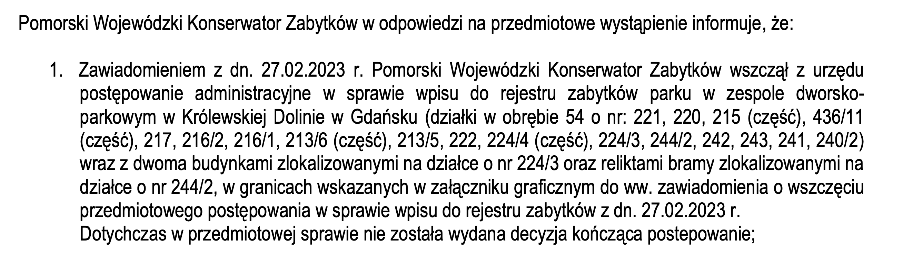
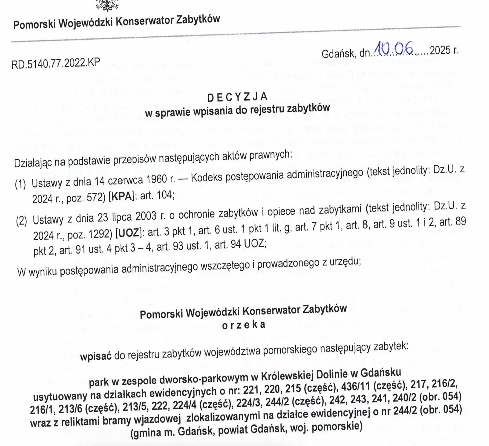

+++
title = '… o tym jak Miasto Gdańsk i DRMG niszczą zabytki'
date = '2025-03-24'
tags = ['aktualnosci']
[cover]
    image = 'fb_cover.png' 
    relative = true
+++

Budowa trasy tramwajowej Nowa Politechniczna (Gdańsk Południe-Wrzeszcz / GPW) wymaga od inwestora ingerencji w zabytkową tkankę miasta. Przedsmak tego co się może dziać mamy już dzisiaj, gdy miasto nielegalnie rozpoczyna prace mające na celu zniszczenie pozostałych elementów dworu w Dolinie Królewskiej.

<!-- more -->

Nową trasę tramwajową Nowa Politechniczna (Gdańsk Południe-Wrzeszcz / GPW)  poprowadzono tak, że trzeba przesunąć zabytek – fragment bramy wjazdowej w parku w Dolinie Królewskiej. Władze miasta, które od prawie 10 lat śpieszą się z realizacją tej inwestycji, chcą to zrobić nie tylko byle jak, ale i nielegalnie.

## Gdzie to jest?

Park Królewskiej Doliny znajdujący się pomiędzy ulicami Do Studzienki a Sobieskiego w Gdańsku to niezwykłe miejsce, które tworzą wzgórza morenowe oraz malowniczy potok. Nazwę zawdzięcza wizycie króla Jana III Sobieskiego, który w 1677 r. przybył do Gdańska. Król był pod wrażeniem piękna parku, rezydencji i samej okolicy. Zażyczył sobie, by odtąd teren nazywać Królewską Doliną ([można przeczytać więcej na stronie trojmiasto.pl](https://www.trojmiasto.pl/historia/Niezwykla-historia-Krolewskiej-Doliny-w-Gdansku-n136349.html)).

Do Parku prowadził wjazd aleją lipową od strony obecnej ul. Sobieskiego, kończący się masywną, piękną, murowaną bramą. Obecnie brama znajduje sie w katastrofalnym stanie. Do dzisiaj zachowała sie jedynie jedna jej cześć, lewa patrzac od ul. Sobieskiego. Stosunkowo niedawno, ten zabytkowy relikt został dodatkowo powaznie uszkodzony w zwiazku z pracami budowlanymi prowadzonymi nieopodal. Filar został obudowany deskami dla bezpieczenstwa i uniknięcia dalszej jego degradacji. Co istotne, do Bramy przylegaja pozostałosci ceglanego muru okalajacego pierwotnie cały teren parku.

## O co chodzi? 

Projekt budowlany planowanej trasy tramwajowej  został przez Dyrekcję Rozbudowy Miasta Gdańsk (DRMG) powierzony firmie Ingeo. Zaprojektowała ona torowisko tak, że  ma przebiegać dokładnie przez środek zabytkowej barokowej brama w Dolinie Królewskiej. W związku z tym Miasto zdecydowało się przenieść bramę w inne miejsce. W tym celu DRMG przeprowadziło przetarg dla firm gotowych się tego podjąć.  Dalej było wszystko wydawałoby się zgodnie z procedurą: 
* wrzesień 2023 – projekt budowlany 
* 29 marca 2024 – wniosek o uzgodnienie konserwatorskie (wniosek WUiA-V.6740.165-3.2024.WK.83390)
* 4 kwietnia 2024 – [uzgodnienie konserwatorskie bez uwag](2024-11-20_Konserwator_ZN.5152.133.2024.ReKo.pdf)  
* 15 kwietnia 2024 – [pozwolenie na budowę](2024-04-15_decyzja_pozwolenie_na_budowe.pdf). 

I wszystko by się może zgadzało, gdyby nie fakt, że 27 lutego 2023 r. Pomorski Wojewódzki Konserwator Zabytków **wszczął z urzędu** postępowanie administracyjne w sprawie wpisu do rejestru zabytków parku w zespole dworsko-parkowym w Królewskiej Dolinie w Gdańsku wraz z dwoma budynkami oraz reliktami bramy - [potwierdzenie wszczęcia procedury wpisu do rejestru zabytków](2024-10-07_UDIP_brama-konserwator_postepowania.pdf). Co się z tym wiąże? A no to, że tego typu prace budowlane, zgodnie z Ustawą o ochronie zabytków i opiece na zabytkami (z 23 lipca 2003 r.)  **NIE MOGĄ** być prowadzone podczas procedury wpisywania obiektu do Rejestru Zabytków. Tymczasem fakt o trwającej procedurze wpisu do rejestru zabytków został całkowicie pominięty lub był wręcz ukrywany przez wszystkie instytucje miejskie, a prawdopodobnie również przez konserwatora.

## W jaki sposób to wyszło na jaw?

We wrześniu 2024 roku, Towarzystwo Opieki nad Zabytkami (TOnZ) Oddział w Gdańsku, które złożyło pilnie wniosek o wpisanie Parku i Bramy do rejestru, sprawa zaczęła się wyjaśniać. Wyszło na jaw, że procedura wpisywania jest już od prawie półtora roku w toku, a inwestor chce prowadzić inwestycje z lekceważeniem obowiązującego prawa. TOnZ wystąpiło zatem z wnioskiem  o dopuszczenie go do udziału w postępowaniu na prawach strony, co zostało uwzględnione przez PWKZ.

## Nieustanne łamanie prawa 

Mimo trwania procedury wpisu zabytku do Rejestru Zabytków, DRMG trzykrotnie ogłosiła przetargi na wykonanie przesunięcia bramy: w czerwcu, sierpniu oraz w październiku 2024 r. Dwa pierwsze przetargi zostały unieważnione ze względu na cenę, która znacznie przewyższała kwotę, jaką Miasto przeznaczało na realizaję tego zamówienia. Trzecie przetarg zakończył się podpisaniem przez DRMG umowy z firmą Budomex Trójmiasto Sp. z o.o. Na przeniesienie bramy przeznaczono kwotę o 75% wyższą, niż pierwotnie zamierzano. DRMG podpisało umowę na kwotę 396 543 zł, podczas gdy kwota, która była pierwotnie przeznaczona na ten cel wynosiła 225 845 zł. 

Co gorsza firma Budomex Trójmiasto sp z o.o. weszła na plac budowy 21 marca 2025, rozpoczynając pracę, dołączając do grona instytucji łamiących prawo dotyczące ochrony zabytków art. 10a ustawy o ochronie zabytków i opiece nad zabytkami, który mówi, że **od momentu wszczęcia postępowania o wpis, do czasu jego zakończenia, obiekt traktowany jest jak zabytek i podlega ochronie**. Samo wszczęcie procedury oznacza bowiem, że: **nie można go bez zgody konserwatora zniszczyć ani znacząco przekształcić** – wszelkie prace budowlane, rozbiórkowe czy zmiany zagospodarowania terenu mogą zostać wstrzymane. 

---

Jeśli ktoś zastanawiał się, co oznaczało, gdy prezydent Aleksandra Dulkiewicz i asystujący jej Piotr Grzelak mówili “o ich wyjątkowej determinacji” w realizowaniu trasy tramwajowej GPW, mają odpowiedź. Chodzi o działanie z pominięciem obowiązujących procedur lub wręcz ze złamaniem prawa. Taka metoda działania obowiązuje nie tylko na odcinku biegnącym przez ul. Bohaterów Getta Warszawskiego ale jak widać na całej długości realizowanej trasy. Po raz kolejny mamy do czynienia z kolejnymi setkami tysięcy złotych z kieszeni Gdańszczan wydawanymi w sposób niezgodny nie tylko z interesem mieszkańców ale i z prawem. Pamiętajmy, że na ten projekt z irracjonalnym przebiegiem trasy tramwajowej miasto wydało już kilkanaście milionów złotych, a to dopiero nieśmiały wstęp.  

---

### Uzupełnienie z 2 lipca 2025

Ta historia ma swój szczęśliwy (częściowy) happy end. 10 czerwca 2025 Pomorski Wojewódzki Konserwator Zabytków podjął decyzje o wpisie do rejestru zabytków. 

Pełna decyzja o wpisie do rejestru zabytków znajduje [jest do pobranie tutaj](2025-06-10_decyzja_wpis.pdf). 


