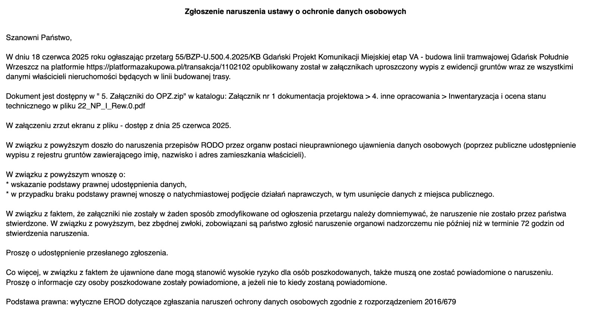
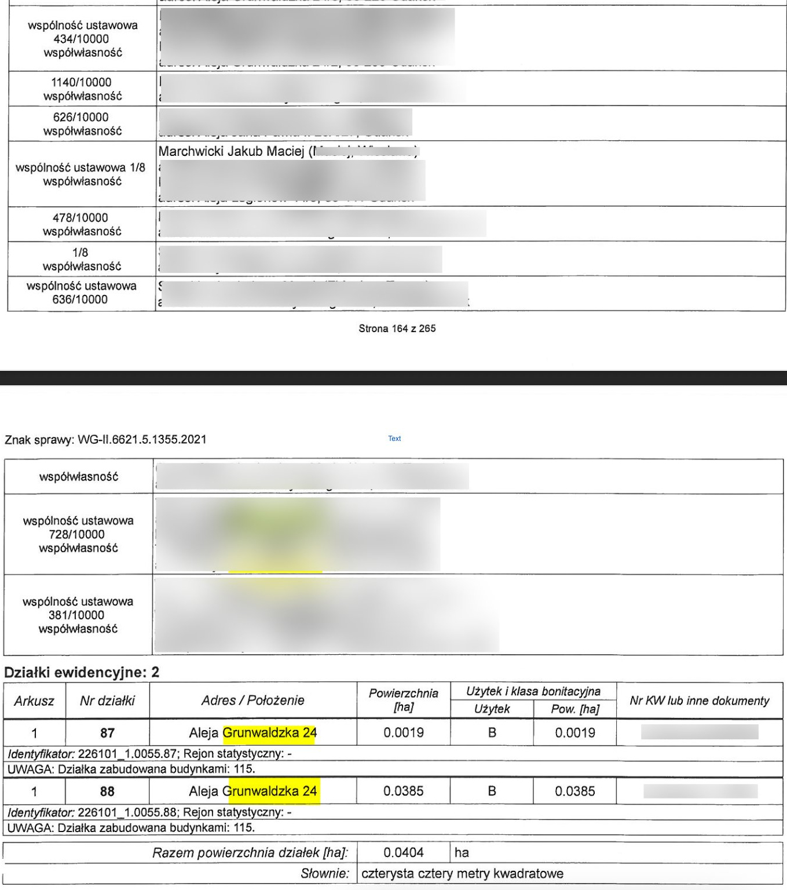

+++
title = '… o ujawnieniu przez Dyrekcję Rozbudowy Miasta Gdańska danych osobowych mieszkańców'
date = '2025-07-25'
tags = ['aktualnosci']
[cover]
    image = 'fb_cover.png' 
    relative = true
+++

W środę wieczorem (23 lipca 2025) przesłaliśmy do Dyrekcji Rozbudowy Miasta Gdańska zgłoszenie o naruszeniu ochrony danych osobowych w dokumentacji przetargu dotyczącego linii tramwajowej GP-W.

<!-- more -->

W dniu 18 czerwca 2025 roku ogłaszając przetarg 55/BZP-U.500.4.2025/KB Gdański Projekt Komunikacji Miejskiej etap VA - budowa linii tramwajowej Gdańsk Południe Wrzeszcz na platformie https://platformazakupowa.pl/transakcja/1102102 opublikowany został w załącznikach uproszczony wypis z ewidencji gruntów wraz ze wszystkimi danymi właścicieli nieruchomości będących w linii budowanej trasy. Co oznacza, że dany były publiczne ponad miesiąc. 

Następnego dnia dane zostały usunięte ze strony przez DRMG i wydany został niewiele mówiący komunikat https://www.drmg.gdansk.pl/index.php/komunikaty/902-informacje-o-zawiadomieniu - z którego nie wynika na czym i kogo dotyczy problem.

O sprawie napisał portal wbijamszpile.pl (https://wbijamszpile.pl/wyciek-danych-z-gdanskiego-urzedu-setki-nazwisk-i-adresow-w-sieci/) oraz Radio Gdańsk (https://radiogdansk.pl/wiadomosci/region/trojmiasto/2025/07/24/wyciek-danych-w-gdansku-urzednicy-opublikowali-miedzy-innymi-poufne-informacje-o-mieszkancach/). 

## Szczegóły naruszenia
W dokumentacji do przetargu ujawnione zostało ponad 300 stron uproszczonego wypisu z ewidencji gruntów, obejmujących imiona, nazwiska, imiona rodziców, adresy zamieszkania i zameldowania oraz numery ksiąg wieczystych dla prawie 200 adresów. Wyciek dotyczy następujących ulic:

* Morenowej, 
* Dobrowolskiego, 
* Do Studzienki, 
* Grunwaldzkiej, 
* Rakoczego, 
* Schuberata, 
* Grodzieńskiej, 
* Fiszera
* Arctowskiego
* Matejki
* Sobieskiego
* Uphagena
* Jarowej
* Jaśkowej Doliny
* Krętej, 
* Politechnicznej
* Raciborskiego, 
* Traugutta, 
* Gojawiczyńskiej,
* Pasteura
* Miszewskiego
* Politechnicznej, 
* Edisona, 
* Wileńskiej, 
* Bohaterów Getta Warszawskiego
* Nałkowkiej
* Edisona
* Jarowej

Zarówno wolumen ujawnionych danych jak i zawartość pozwala domniemywać że jest to naruszenie znaczące. W szczególności, że za naruszenie odpowiada instytucja zaufania publicznego, która całą sprawę obecnie traktuje mocno po macoszemu. 

Tak jak pisaliśmy, dane były publiczne ponad miesiąc i były pobierane wielokrotnie (strona dotycząca postępowania przetargowego była odwiedzana dwudziestokrotnie częściej niż inne przetargi ogłaszane przez Dyrekcję Rozbudowy Miasta Gdańska). 

## Jakie kroki powinien podjąć mieszkaniec
Cytując z DRMG, które jednak nie poczuwa się do poinformowania mieszkańców którzy zostali dotknięci wyciekiem danych:

> W związku z tą sytuacją istnieje ryzyko pozyskania przez osobę trzecią danych osobowych właścicieli nieruchomości, co mogłoby doprowadzić do posłużenia się tymi danymi. Administrator danych, mając na celu zapewnienie jak najwyższych standardów bezpieczeństwa przetwarzania danych osobowych, informuje o konsekwencjach i negatywnych skutkach, jakie mogą potencjalnie wystąpić w związku naruszeniem ochrony danych.
> Wyżej opisane naruszenie, może potencjalnie skutkować powstaniem szkód majątkowych lub niemajątkowych, takich jak np.:
> * podszycie się pod inną osobę lub instytucję w celu wyłudzenia dodatkowych, określonych informacji,
> * osoby trzecie mogą podjąć próbę zawarcia umów cywilno-prawnych przy użyciu metod, w których tożsamość nie jest weryfikowana za pomocą dokumentu tożsamości,
> * dane mogą zostać wykorzystane np. do oddania głosu w głosowaniu nad budżetem obywatelskim.
> 
> W celu zminimalizowania ewentualnych negatywnych skutków naruszenia zalecamy aby osoby, których dane ujawniono:
> * ignorowały nieoczekiwane przesyłki listowne lub paczki,
> * **założyły konto w systemie informacji kredytowej lub gospodarczej w celu dodatkowego zabezpieczenia swoich danych przed nieuprawnionym wykorzystaniem, a także sprawdzenia dotychczasowej historii kredytowej**,
> * **zastrzegły numer PESEL**.

Przede wszystkim można skontaktować się bezpośrednio z DRMG i zweryfikować czy naruszenie danych osobowych mnie dotyczy. Najlepiej telefonicznie 58 320 51 20 lub mailowo iod.drmg@gdansk.gda.pl (chociaż nie znam czasów odpowiedzi, na nasze zgłoszenie ze środy nikt jeszcze nie odpowiedział).

## Zgłoszenie do Urzędu Ochrony Danych Osobowych

Można też samodzielnie wysłać skargę do UODO - co zostało opisane tutaj: https://uodo.gov.pl/pl/526/2464

Można to zrobić poprzez ePUAP wysłać informację następującej treści.

**Tytuł: Naruszenie przepisów OODO przez DRMG w Gdańsku**

> W dniu 18 czerwca 2025 roku Dyrekcja Rozbudowy Miasta Gdańska ogłaszając przetarg  55/BZP-U.500.4.2025/KB Gdański Projekt Komunikacji Miejskiej etap VA - budowa linii tramwajowej Gdańsk Południe Wrzeszcz na platformie https://platformazakupowa.pl/transakcja/1102102 opublikowała w załącznikach uproszczony wypis z ewidencji gruntów wraz ze wszystkimi danymi właścicieli nieruchomości będących w linii budowanej trasy.
> 
> Dokument był dostępny w " 5. Załączniki do OPZ.zip" w katalogu: Załącznik nr 1 dokumentacja projektowa > 4. inne opracowania > Inwentaryzacja i ocena stanu technicznego w pliku 22_NP_I_Rew.0.pdf
> 
> W załączeniu zrzut ekranu z pliku - dostęp z dnia 25 czerwca 2025. 
> 
> Zgodnie z wyrokiem z dnia 26 września 2017 r. (sygn. akt I SAB/Wa 250/17), w którym Wojewódzki Sąd Administracyjny w Warszawie wyraźnie wskazał: „(...) aby podaniu można było nadać dalszy bieg winno ono zawierać adres osoby je wnoszącej, który może być adresem zamieszkania, pobytu bądź do korespondencji. Niespełnienie zaś tego wymogu nakłada na organ obowiązek pozostawienia podania bez rozpoznania”
> 
> Wskazuje adresu poczty tradycyjnej w celu zindywidualizowania mnie jako strony postępowania.
> 
> [imię i nazwisko oraz adres korespondencyjny]

---

Czy DRMG miało prawo do przetwarzania danych osobowych w tej formie - nie wiemy. Ale wystąpiliśmy do Wydziału Geodezji Urzędu Miasta, które udostępniło dane, o wyjaśniania. 

Dodatkowo analizujemy temat ze specjalistami z zakresu ochrony danych na temat ewentualnych kolejnych kroków które należałoby podjąć. 