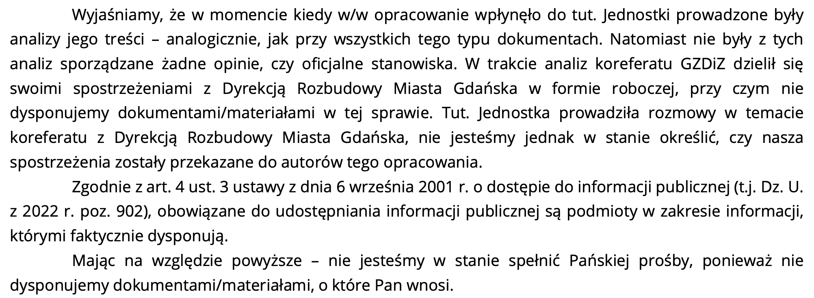

+++
title = '... o wniosku o wpis do rejestru zabytków - konferencja prasowa'
date = '2026-01-13'
draft = false
tags = ['aktualnosci', 'zabytki', 'dokumentacja', 'konferencja prasowa']
[cover]
    image = 'fb_cover.png' 
    relative = true
+++

**31 grudnia 2025 roku, w sylwestrowe popołudnie, nadeszła wiadomość, na którą mieszkańcy Wrzeszcza czekali od dłuższego czasu. Pomorski Wojewódzki Konserwator Zabytków oficjalnie wszczął postępowanie w sprawie wpisu do rejestru zabytków historycznego zespołu budowlanego obejmującego ulice: Bohaterów Getta Warszawskiego, Politechniczną i Fiszera.**

<!-- more -->

To nie tylko procedura administracyjna – to przyznanie racji stronie społecznej, która od lat alarmuje: ta część Gdańska to perła, którą urzędnicy chcieli poprzecinać torowiskiem, zalać betonem, a mieszkańców jako niepotrzebny element wysiedlić.
Jako Stowarzyszenie Dolina Królewska, wnioskodawcy tego postępowania, przedstawiamy kluczowe fakty i kontekst, który był dotychczas pomijany w debacie publicznej zdominowanej przez narrację inwestora.

## Czym jest historyczny zespół budowlany i co oznacza ten wpis?

Musimy zerwać z myśleniem o zabytkach jedynie jako o pojedynczych „domkach”. Zgodnie z art. 3 pkt 13 ustawy o ochronie zabytków, zespół budowlany to powiązana przestrzennie grupa budynków, która stanowi o unikalnym charakterze miejsca. Wyróżnia ją wspólna forma architektoniczna, styl (w tym przypadku głównie secesja i eklektyzm przełomu XIX i XX wieku), zastosowane materiały oraz układ przestrzenny.
Wpis obszarowy do rejestru to tarcza ochronna dla całej tkanki miejskiej. W przeciwieństwie do wpisu indywidualnego, decyzja nie wymienia każdego gzymsu z osobna, lecz wyznacza granice chronionego układu. Oznacza to, że ochronie podlega **przestrzeń, relacje między budynkami, osie widokowe i tzw. „duch miejsca”**, a nie tylko mury konkretnej kamienicy.

* [Obwieszczenie Pomorskiego Wojewódzkiego Konserwatora Zabytków o rozpoczęciu postępowania w sprawie wpisu do rejestru](2025-12-31_RD.5140.156.2025.JP_OBWIESZCZENIE_wszczęcie_zespół_budowlany_Boh._Getta.pdf)
* [Mapa obszaru - załacznik do obwieszczenia](2025-12-31_RD.5140.156.2025.JP_zalacznik_graficzny_do_wszczęcia_zespol_budowlany_Boh._Getta.pdf)

## Koniec z umniejszaniem wartości historycznej Wrzeszcza

Sam fakt wszczęcia postępowania jest dla nas, mieszkańców i aktywistów, **jednoznacznym potwierdzeniem wartości historycznej tej zabudowy**. Przez lata, w toku przygotowań do budowy trasy tramwajowej Gdańsk Południe – Wrzeszcz (wcześniej nazywaniej Nową Politechniczną), urzędnicy miejscy i projektanci starali się marginalizować znaczenie tych kamienic. Traktowano je jak przeszkody na mapie, a nie jak dziedzictwo kulturowe. Decyzja Konserwatora o rozpoczęciu procedury zadaje kłam tej narracji. To dowód na to, że mamy do czynienia z unikalnym świadectwem rozwoju przestrzennego Gdańska, które przetrwało II wojnę światową i zasługuje na najwyższą formę ochrony.

## Dlaczego Ewidencja Zabytków to za mało? Ochrona Rejestrowa jako konieczność

Dotychczasowa ochrona (Gminna Ewidencja Zabytków) okazała się fikcją, co dobitnie pokazały ostatnie lata „dialogu” z Miastem. Nasz wniosek o wpis do Rejestru Zabytków ma trzy kluczowe cele:

* **Zatrzymanie degradacji tożsamości dzielnicy**. Wizualizacje, które wypływają z urzędu miasta, są przerażające. Pokazują dążenie do zastąpienia historycznej tkanki nową zabudową, która w żaden sposób nie koresponduje z istniejącymi kamienicami. Plany te wpisują się w bezwartościową architekturę, narzucaną przez deweloperów i bezrefleksyjnych planistów. Najlepszym a może raczej najgorszym przykładem tego jest tzw. „czarna rozpacz” czyli budynek przy ul. Grunwaldzkiej 144 (dawna stacja benzynowa na rogu Dekerta i Grunwaldzkiej). Choćby ze względu na zbliżoną sytuację (na rogu ul. BGW i Grunwaldzkiej znajduje się analogiczna – tym razem naprawdę już ostatnia w Gdańsku zabytkowa stacja benzynowa – Deluxe Stacja /Thali, wobec której deweloperzy mają niepokojące plany), ochrona prawna przed tego typu degradacją przestrzeni jest konieczna. Rejestr ma temu zapobiec, wymuszając projekty zgodne z duchem tego miejsca.
* **Naturalne rozszerzenie ochrony**. Obszar ten graniczy z wpisaną już do rejestru Kolonią Abegga. Kamienice przy Bohaterów Getta Warszawskiego, Politechnicznej i Fiszera są naturalną kontynuacją tego historycznego założenia. To spójny organizm, który nie może być sztucznie dzielony urzędniczą kreską.
* **Realne bezpieczeństwo w obliczu budowy tramwaju**. To najważniejszy punkt. Planowana trasa „Nowa Politechniczna” przebiega w bezpośrednim sąsiedztwie budynków posadowionych na drewnianych palach w trudnym, torfowym gruncie. Ryzyko pękania ścian, osiadania fundamentów, a nawet katastrofy budowlanej jest realne i jak dotąd bagatelizowane przez inwestora. **Ochrona rejestrowa jest silniejsza od ewidencyjnej**. Wymusza ona na inwestorze zupełnie inny sposób współpracy z konserwatorem zabytków konserwatorskich, wymaga uzgodnienie, a nie tylko niewiążących opinii. W przypadku podjęcia prac budowlanych w sąsiedztwie zabytków rejestrowych tak niepokojące zjawiska, jak zmiany poziomu zwierciadła wód gruntowych, mogące mieć wpływ na stabilność budynków, nie będą mogły być przez urzędników bagatelizowane. Dotychczasowe zapowiedzi urzędników, którzy deklarowali, że zmiany poziomu wód gruntowych pozostaną bez oceny, czy są wynikiem naturalnych sezonowych wahań, czy wynikają ze zmian związanych z budową trasy (palowaniem, ściankami szczelnymi, podziemnym zbiornikiem retencyjnym). 	 

Zdajemy sobie sprawę, że część działek objętych wnioskiem figuruje w decyzji ZRiD. Jednakże, żyjemy w państwie prawa. Mamy odpowiednie organy, które muszą teraz rzetelnie ocenić wpływ tej inwestycji na **rejestrowy zespół zabytkowy**. To zmienia reguły gry – z „budujemy bez względu na wszystko” na „budujemy z poszanowaniem prawa i historii”.

## Miasto utraciło nasze zaufanie. Potrzebujemy zewnętrznego nadzoru

Niestety, nasze doświadczenia z Urzędem Miejskim i podległymi mu jednostkami to pasmo rozczarowań, a wręcz działań na granicy prawa. Nie wierzymy już w zapewnienia o „bezpieczeństwie” i „monitoringu”. Dlatego tak bardzo zależy nam, aby Pomorski Wojewódzki Konserwator Zabytków stał się realną stroną w tym procesie, z kompetencjami władczymi, a nie tylko doradczymi.

Lista grzechów Miasta wobec mieszkańców i dziedzictwa jest długa:

* **Nielegalne prace przy zabytkach**: W marcu 2025 r. byliśmy świadkami skandalicznego rozpoczęcia robót budowlanych przy relikcie bramy wjazdowej w Dolinie Królewskiej bez wymaganych zezwoleń. Miasto potraktowało zabytek jak gruz, co opisaliśmy szczegółowo na naszej stronie. To pokaz arogancji i braku szacunku dla procedur.
[Sprawa została zgłoszona i przejęta przez Powiatowy Inspektorat Nadzoru Budowlanego](2025-04-07_pinb.081.409.2025.kk.03_do_studzienki_36_królewska_dolina-sig.pdf)

* **Nonszalancja w ochronie mieszkańców**: W lipcu 2025 r. doszło do wycieku danych w Dyrekcji Rozbudowy Miasta Gdańska. Instytucja, która ma dbać o nasze bezpieczeństwo przy inwestycjach, nie potrafi zadbać nawet o bezpieczeństwo naszych danych osobowych.
[Urzad Ochrony Danych Osobowych prowadzi w tej kwestii osobne postępowanie](2025-10-17_UODO-wszczeci_postepowania_DS.523.700.2025_redacted.pdf)
  
* **Ukrywanie kluczowych dokumentów**: Mimo wyroków sądowych nakazujących ujawnienie informacji publicznej, Miasto wciąż odmawia pokazania analiz, które rzekomo uzasadniają wybór wariantu trasy przez ul. Bohaterów Getta Warszawskiego. Co ukrywają urzędnicy? Czyżby brak merytorycznych przesłanek dla niszczenia naszej ulicy? Dodatkowo władze miasta ukrywają przed wykonawcami startującymi w przetargu realne zagrożenia, które zostały już rozpoznane na etapie przygotowywania inwestycji. Np. kluczowa dla oceny ryzyka mapa stref zagrożeń zawaleniem lub uszkodzeniem budynków na skutek wprowadzenia głębokich wykopów… zniknęła z wersji dokumentacji przekazanej w ramach dokumentacji przetargowej. Gdy to zauważyliśmy przesłaliśmy do wszystkich oferentów kopie zatajanej mapy wraz z wyjaśnieniem. 

Niesamowite jest, jak wybiórcze w argumentach jest miasto i zastępca prezydenta miasta - Piotr Grzelak.
Z jednej strony, oczekują od mieszkańców kontrraportów, naukowej ekspertyzy - zbijając ich argumenty brakiem wykształcenia kierunkowego i nie posiadaniem tytułu doktora nauk. A w tym samym czasie, kluczowe decyzje, prowadzące do wydania miliardów złotych, opierają na słowach anonimowych urzędników - uznając je za istotniejsze niż [opracowanie naukowe Politechniki Gdańskiej - czyli koreferat](/kalendarium/2016-07-01_koreferat_politechniki_gdanskiej/). 

* [GZDiZ wyjaśnia, że nie ma żadnych dokumentów na które powołuje się prezydent miasta](2025-12-30_ZDiZ_6304.579.2025.11020-odpowiedz.pdf)
* [DRMG nie realizuje wyroku sadu](2025-12-15_DRMG_odpowiedz.pdf) i [odmawia wydania dokumentów, pomimo ponaglenia](2025-12-23_DRMG_odpowiedz_2.pdf)

---

Wszczęcie postępowania o wpis do rejestru to żółta kartka dla inwestora i władz miasta. Mamy nadzieję, że ten krok pozwoli na wreszcie rzeczową i niezależną ocenę wpływu inwestycji tramwajowej na naszą okolicę. Liczymy na to, że wadliwe i powierzchowne opinie konserwatorskie z przeszłości, które pomijały kwestie bezpieczeństwa sąsiedztwa i stabilności gruntu, zostaną zweryfikowane i poprawione.
Wrzeszcz to nie poligon doświadczalny dla drogowców. To nasz dom i historia Gdańska, której nie oddamy bez walki.

Mamy również świeży analogiczny przykład, jak kończy się lekceważenie interesu mieszkańców przy realizowaniu inwestycji niechlujnym trybem ZRID. [Mieszkańcy Starego Pola pod Malborkiem po zrealizowaniu przebudowy Drogi Krajowej 22 zmagają się z zalewaniem ich domów i pól przez wodę](https://malbork.naszemiasto.pl/po-przebudowie-dk-22-pojawil-sie-problem-z-zalewaniem-posesji-w-starym-polu-panstwowe-instytucje-odsylaja-do-siebie-nawzajem/ar/c1p2-28587147). Co się dzieje obecnie? Wody Polskie, wykonawca i inwestor przerzucają się winą za szkody wynikłe z błędnie zaprojektowanej lub źle wykonanej inwestycji, a mieszkańcy muszą sami radzić sobie ze szkodami. W podobnej sytuacji chce nas postawić prezydent Aleksandra Dukiewicz, która w pełni świadomie brnie do realizacji inwestycji w wariancie gorszym i niosącym zagrożenie dla okolicznych mieszkańców ze świadomym użyciem procedury ZRID nieadekwatnej do użycia w zabytkowym centrum miasta i uniemożliwiającej jakąkolwiek ochronę interesu mieszkańców
