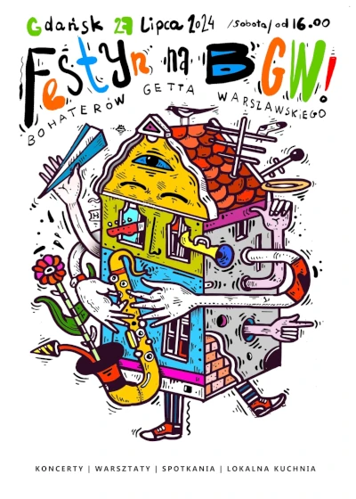



Zaczynamy w sobotę, około godziny 16 👉 [Nasze wydarzenie na facebook'u](https://www.facebook.com/events/409180222158764/)

Mamy w planach:
**Żywą bibliotekę** - Książką w tej formie będą mieszkańcy, a czytelnikiem - goście. Będzie można zadać konkretne pytanie bez sięgania do spisu treści. 

**Katalog starych zdjęć i archiwum części kamienic**. Chcesz pokazać swoje zdjęcia z przeszłości?To my też! Odpowiedź proszę na tego maila.  

**Warsztaty kreatywne z materiałem** - czyli jak samodzielnie zrobić torbę ze starej koszulki, bądź jak tchnąć nowe życie w niechciany już ciuch dekorując go elementami miejskiego otoczenia. Także jak macie niechciane t-shirty, możecie zabrać je ze sobą. 

**Dużo farb i plakatów** - więc będzie można wymienić plakat protestu na nowszy, lepszy, lub zrobić dla kogoś. Albo po prostu potrenować kreskę. I nie, nie musi być o tramwaju..  Ale nie tylko my będziemy malować, będziemy gościć artystę, który pomaluje dla nas. Artystą będziecie Wy!

**Muzycznie** wesprą nas lokalne kolektywy muzyczne **Sekatory** i **Wibrysy**, a do wieczora tanecznie będą przygrywać znajomi DJe. 





Będzie coś do popicia i przekąszenia, może wata cukrowa, może coś z lokalnych zaprzyjaźnionych restauracji. 

<---> <!-- magic separator, between columns -->

Plakat autorstwa Pawła Króla - https://www.pawelkrolart.com/ - [pobierz plakat](bgw_festyn.webp)



